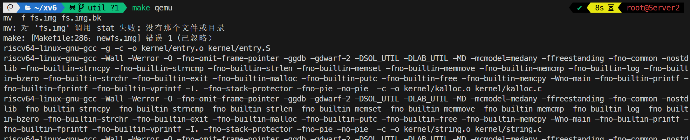
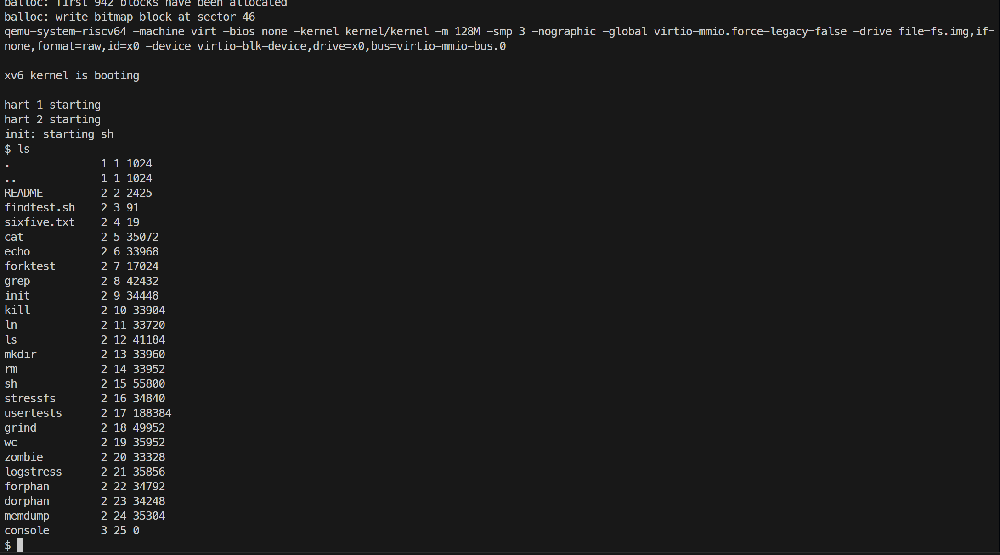
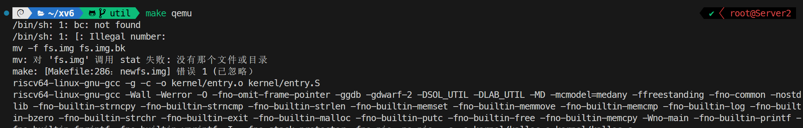
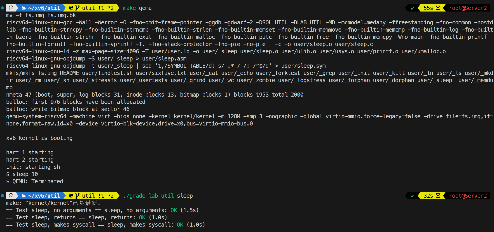
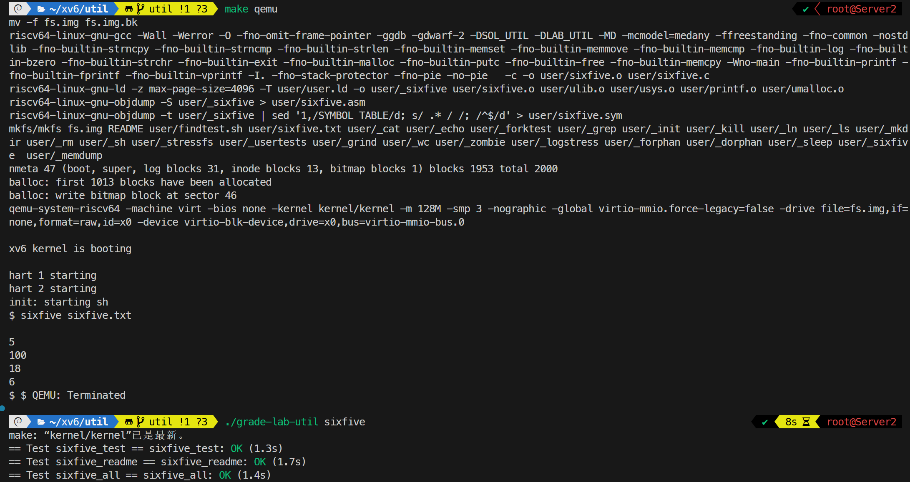
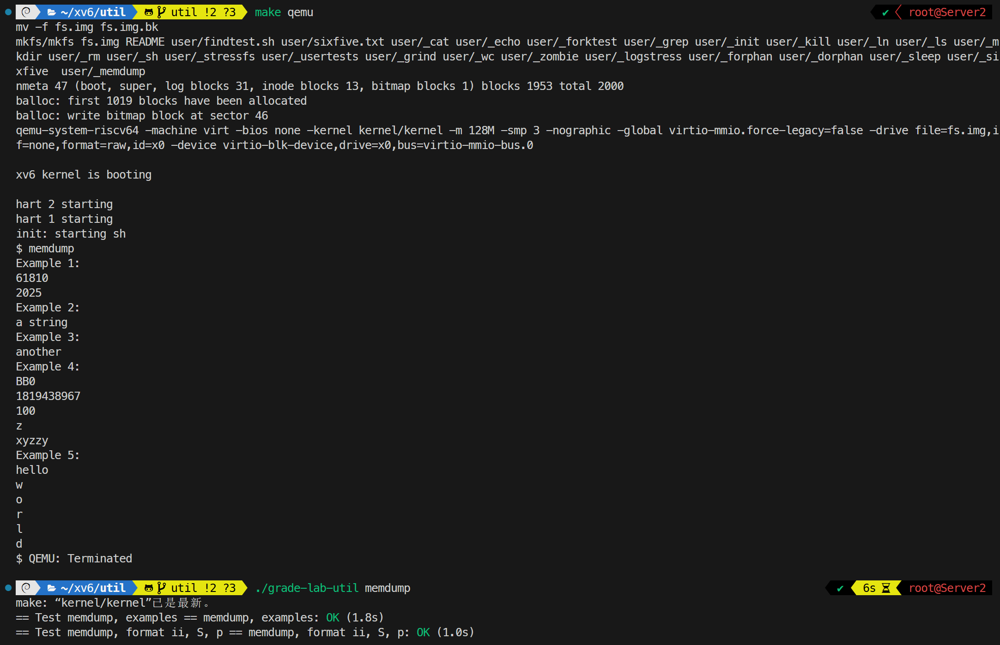
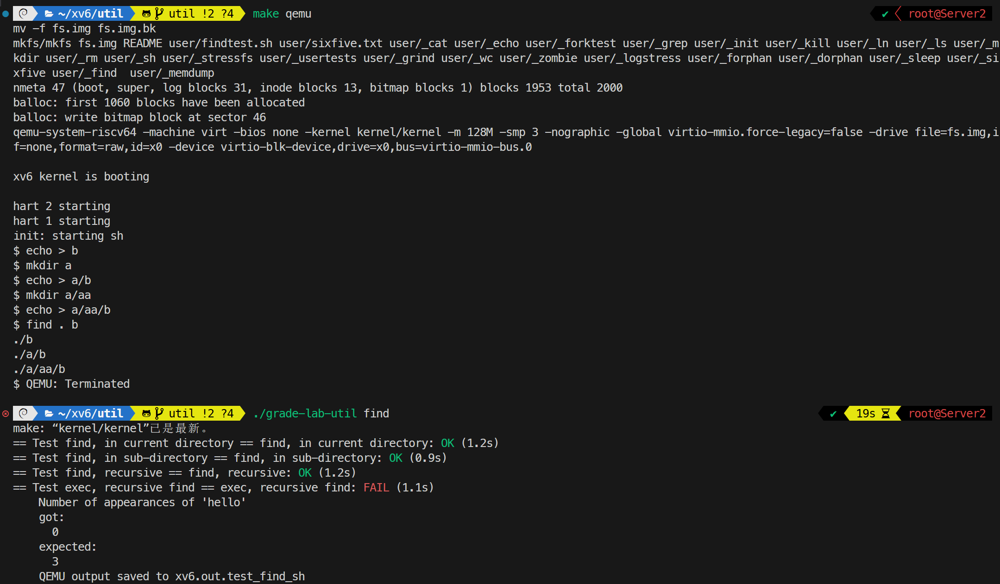
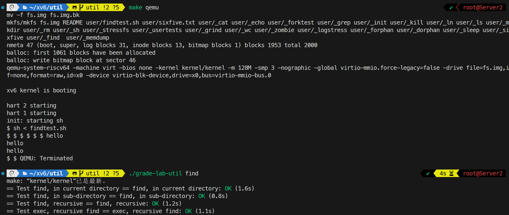
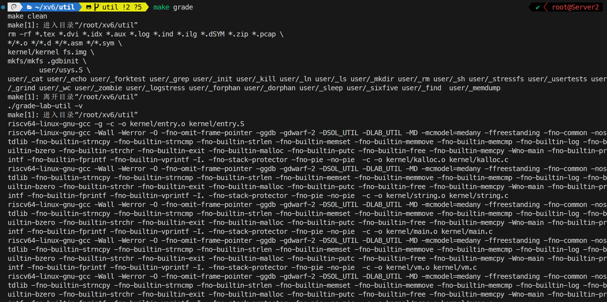
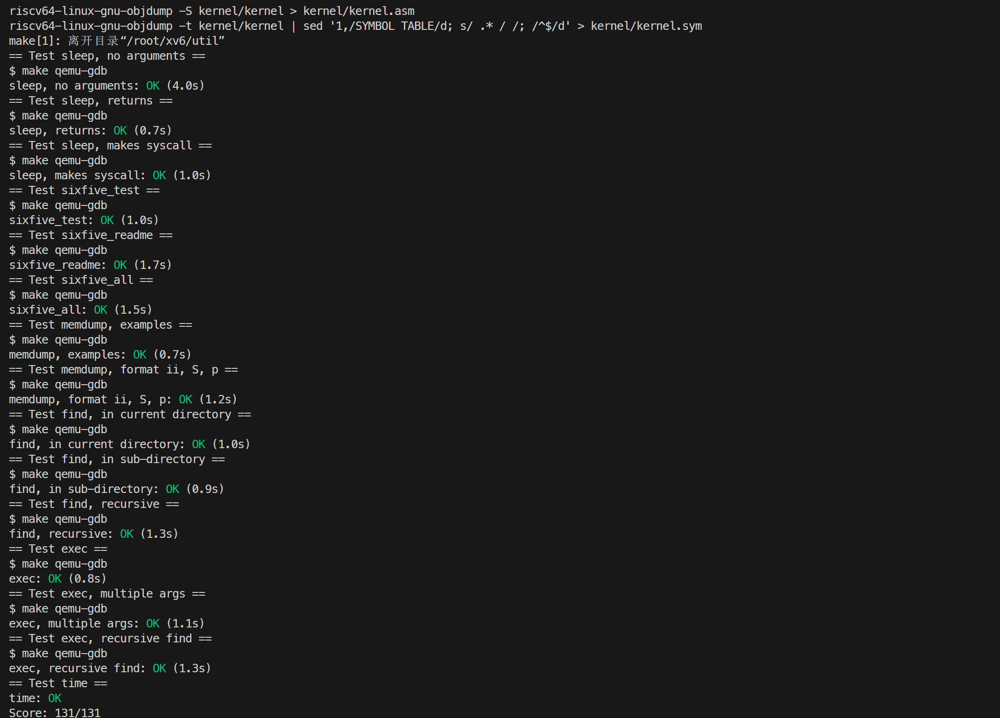

# 1. Xv6 and Unix utilities

## Boot xv6

### 要求

构建并运行 xv6 系统，并尝试在 xv6 shell 中运行 ls 程序。

### 内容

执行 `make qemu` 命令构建并运行 xv6 系统。



进入 shell 后，输入 `ls` 命令查看当前目录下的文件列表。



输入 `Ctrl-a x` 退出。

### 遇到的问题及心得

初次编译时出现意外报错，发现原因为缺少 bc 工具，执行 `apt install bc` 安装后重新编译正常。



## sleep

### 要求

在 `user/sleep.c` 中实现用户态 `sleep` 程序，使其能够接收一个表示 tick 的命令行参数，并调用 `pause()` 系统调用暂停相应时长。若用户未提供正确数量的参数，程序应输出错误提示。

### 内容

在 `Makefile` 的 `UPROGS` 中加入 `$U/_sleep`，使 `make qemu` 能够编译该程序并将其写入 xv6 文件系统。

`user/sleep.c` 的实现如下：

```c
#include "kernel/types.h"
#include "kernel/stat.h"
#include "user/user.h"

int main(int argc, char* argv[])
{
    int n;

    if (argc != 2) {
        printf("Usage: sleep n\n");
        exit(1);
    }
    n = atoi(argv[1]);
    pause(n);
    exit(0);
}
```

程序首先检查命令行参数数量；参数不正确时输出用法提示并以非零状态退出。参数正确时，使用 `atoi()` 将字符串转换为整数，随后调用 `pause(n)` 暂停指定的 tick 数，最后正常退出。

在 xv6 shell 中执行 `sleep 10` 以及在宿主机执行 `./grade-lab-util sleep` 单项测试。



### 遇到的问题及心得

题目提示使用 `pause()` 系统调用，该调用需要一个参数，对这个参数的含义不理解。阅读 `kernel/sysproc.c` 中 `sys_pause()` 的实现后，了解到该参数表示暂停的 tick 数。遇到代码问题时先阅读相关源码、理解功能是必要的。

## sixfive

### 要求

实现用户态程序 `sixfive`，练习使用 `open()`、`read()` 等系统调用以及 C 字符串处理。程序应逐个处理命令行指定的输入文件，找出其中所有能够被 5 或 6 整除的十进制整数并逐行输出。数字由连续的十进制数字组成，只能由字符串 `" -\r\t\n./,"` 中的字符分隔，文件开头和结尾也视为隐式分隔符；例如 `xv6` 中的 `6` 不属于合法数字，而 `/6,` 中的 `6` 属于合法数字。

### 内容

在 `Makefile` 的 `UPROGS` 中加入 `$U/_sixfive`。程序通过 `open()` 以只读方式依次打开命令行给出的文件，处理完成后调用 `close()` 关闭文件描述符；未提供文件名、文件打开失败或读取失败时，输出相应错误信息并退出。

定义分隔符字符串，并在 `sixfive()` 中每次调用 `read()` 读取一个字符：

```c
const char* SEPS = " -\r\t\n./,";

void sixfive(int fd)
{
    char cur = '\0';
    int num = 0;
    int status = 0;

    while (1) {
        int n = read(fd, &cur, 1);
        if (n < 0) {
            printf("sixfive: read error\n");
            exit(1);
        } else if (n == 0) {
            if (num % 6 == 0 || num % 5 == 0)
                printf("%d\n", num);
            break;
        } else if (strchr(SEPS, cur) == 0) {
            if (status == 0) {
                if (cur >= '0' && cur <= '9')
                    num = num * 10 + (cur - '0');
                else
                    status = 1;
            }
        } else {
            if (status == 0) {
                if (num % 6 == 0 || num % 5 == 0)
                    printf("%d\n", num);
                num = 0;
            } else {
                status = 0;
                num = 0;
            }
        }
    }
}
```

`strchr(SEPS, cur)` 用于判断当前字符是否为分隔符。对于合法数字字符，通过 `num = num * 10 + (cur - '0')` 累积数值；若一个片段中出现非数字字符，则将其标记为无效，直到遇到下一个分隔符再重置状态。遇到分隔符或文件结束时，检查当前数值能否被 5 或 6 整除，满足条件时将其输出。

主函数遍历全部输入文件并调用上述解析函数：

```c
for (int i = 1; i < argc; i++) {
    int fd = open(argv[i], O_RDONLY);
    if (fd < 0) {
        printf("sixfive: cannot open %s\n", argv[i]);
        exit(1);
    }
    sixfive(fd);
    close(fd);
}
```

在 xv6 shell 中执行 `sixfive sixfive.txt` 以及在宿主机执行 `./grade-lab-util sixfive` 单项测试。



### 遇到的问题及心得

程序初次撰写时设定为只读取一个参数 argv[1]，未考虑多个文件的情况。在执行 `./grade-lab-util sixfive` 测试时发现问题。遂提取函数，修改为遍历所有命令行参数依次执行 `sixfive(int fd)`，正常运行。在撰写代码前应先明确需求。

## memdump

### 要求

补全 `user/memdump.c` 中的 `memdump(char *fmt, char *data)` 函数，练习使用 C 指针访问不同类型的内存数据。函数按照格式字符串 `fmt` 从前向后解释 `data` 指向的内存，并支持以下格式字符：`i` 按十进制输出 4 字节整数，`p` 按十六进制输出 8 字节整数，`h` 按十进制输出 2 字节整数，`c` 输出 1 字节 ASCII 字符，`s` 将接下来的 8 字节解释为字符串指针并输出其指向的字符串，`S` 将剩余数据直接解释为空字符结尾的字符串。

### 内容

实现时遍历格式字符串，将当前 `data` 转换为相应类型的指针，解引用并输出数据，再按照该类型占用的字节数移动 `data`：

`memdump()` 的实现如下：

```c
void memdump(char* fmt, char* data)
{
    for (int i = 0; fmt[i] != '\0'; i++) {
        char c = fmt[i];
        if (c == 'i') {
            int* p = (int*)data;
            printf("%d\n", *p);
            data += sizeof(int);
        }
        else if (c == 'p') {
            unsigned long long* p = (unsigned long long*)data;
            printf("%llx\n", *p);
            data += sizeof(void*);
        }
        else if (c == 'h') {
            short* p = (short*)data;
            printf("%d\n", *p);
            data += sizeof(short);
        }
        else if (c == 'c') {
            char* p = (char*)data;
            printf("%c\n", *p);
            data += sizeof(char);
        }
        else if (c == 's') {
            char** p = (char**)data;
            printf("%s\n", *p);
            data += sizeof(char*);
        }
        else if (c == 'S') {
            char* s = (char*)data;
            printf("%s\n", s);
            data += strlen(s) + 1;
        }
        else {
            printf("Unknown format specifier: %c\n", c);
        }
    }
}
```

直接执行 `memdump` 时，程序使用预设的数组、字符串和结构体检查不同格式的组合；指定格式参数时，程序从标准输入读取最多 512 字节的数据，再调用 `memdump()` 解析。

在 xv6 shell 中执行 `memdump` 以及在宿主机执行 `./grade-lab-util memdump` 单项测试。



### 遇到的问题及心得

格式串 `h` 输出二字节整数时，一开始使用了 `printf("%hd\n", *p)`，发现直接输出了字符串 `%hd`，猜测在 xv6 的 `printf()` 中该格式符不被支持，改为 `printf("%d\n", *p)` 后正常输出。

## find

### 要求

在 `user/find.c` 中实现简化版 UNIX `find` 程序，参考已实现的 `user/ls.c` 示例，使用 `open()`、`read()` 和 `fstat()` 等系统调用，在指定目录树中递归查找名称匹配的文件并输出完整路径。程序需要正确读取目录项、使用 `strcmp()` 比较文件名，并在递归过程中跳过 `.` 和 `..`，避免无限循环。

### 内容

在 `Makefile` 的 `UPROGS` 中加入 `$U/_find`。

程序接收起始路径和目标文件名两个参数，通过 `fmtname()` 找到路径中最后一个 `/` 后的部分，以获得当前文件的名称：

```c
char* fmtname(char* path)
{
    char* p;
    for (p = path + strlen(path); p >= path && *p != '/'; p--)
        ;
    return p + 1;
}
```

递归函数首先使用 `open()` 打开路径，再通过 `fstat()` 判断其类型。对于普通文件，使用 `strcmp()` 比较文件名，匹配时输出当前完整路径；对于目录，使用 `read()` 逐个读取 `struct dirent`，跳过无效目录项以及 `.`、`..`，拼接子路径后递归处理：

```c
void find(char* path, char* filename)
{
    char newpath[512];
    struct stat st;
    struct dirent de;
    int fd = open(path, O_RDONLY);

    if (fd < 0) {
        printf("find: cannot open %s\n", path);
        exit(1);
    }
    if (fstat(fd, &st) < 0) {
        printf("find: cannot stat %s\n", path);
        close(fd);
        exit(1);
    }

    switch (st.type) {
    case T_FILE:
        if (strcmp(fmtname(path), filename) == 0)
            printf("%s\n", path);
        break;
    case T_DIR:
        if (strlen(path) + 1 + DIRSIZ + 1 > sizeof(newpath)) {
            printf("find: path too long\n");
            break;
        }
        while (read(fd, &de, sizeof(de)) == sizeof(de)) {
            if (de.inum == 0)
                continue;
            if (strcmp(de.name, ".") == 0 ||
                strcmp(de.name, "..") == 0)
                continue;

            strcpy(newpath, path);
            strcpy(newpath + strlen(path), "/");
            strcpy(newpath + strlen(path) + 1, de.name);
            find(newpath, filename);
        }
        break;
    }
    close(fd);
}
```

主函数检查参数数量后调用 `find(argv[1], argv[2])`。每一层递归使用独立的 `newpath` 缓冲区，并在返回前关闭当前路径的文件描述符，从而完成整个目录树的深度优先遍历。

在 xv6 shell 中创建测试文件并执行 `find . b`，以及在宿主机执行 `./grade-lab-util find` 单项测试（最后一条测试错误为下一题 `exec` 所要实现的内容）。



### 遇到的问题及心得

`fmtname()` 函数直接从 `user/ls.c` 中复制过来，未阅读其内容，导致在第一次测试时出现错误。随后发现 `ls.c` 的实现中，`fmtname()` 函数会对字符串最后加 padding 以对齐输出格式，而 `find` 中不需要该功能。

## exec

### 要求

扩展上一题的 `find` 程序，使其支持 `find <目录> <文件名> -exec <命令及参数>`。找到名称匹配的文件后，不再直接输出路径，而是执行指定命令，并将匹配文件的路径追加为最后一个命令行参数。每次执行命令时使用 `fork()` 创建子进程，在子进程中调用 `exec()`，父进程则调用 `wait()` 等待命令执行结束；未指定 `-exec` 时，保留原有的路径输出行为。

### 内容

引入 `kernel/param.h` 中定义的 `MAXARG`，使用空指针初始化的参数数组保存 `-exec` 后的命令及其参数。主函数检查可选参数的格式，并将命令数组传入递归查找函数：

```c
int main(int argc, char* argv[])
{
    if (argc < 3 || (argc > 3 && strcmp(argv[3], "-exec") != 0)) {
        printf("Usage: find <directory> <filename> (-exec <cmd>)\n");
        exit(1);
    }

    char* cmd[MAXARG] = {0};
    if (argc > 3) {
        for (int i = 4; i < argc; i++)
            cmd[i - 4] = argv[i];
    }
    find(argv[1], argv[2], cmd);
    exit(0);
}
```

当递归遍历发现匹配的普通文件时，首先判断 `cmd[0]` 是否为空。若未指定命令，则仍然输出文件路径；否则调用 `fork()`，在子进程中找到命令参数数组的结尾，将当前文件路径追加进去，再使用 `exec(cmd[0], cmd)` 执行命令。父进程调用 `wait(0)`，确保当前命令完成后再继续遍历：

```c
if (strcmp(fmtname(path), filename) == 0) {
    if (cmd[0] != 0) {
        int pid = fork();
        if (pid < 0) {
            printf("find: fork error\n");
            exit(1);
        }
        else if (pid == 0) {
            int i = 0;
            while (cmd[i] != 0)
                i++;
            cmd[i] = path;
            exec(cmd[0], cmd);
            printf("find: exec error\n");
            exit(1);
        }
        else {
            wait(0);
        }
    }
    else {
        printf("%s\n", path);
    }
}
```

例如执行 `find . wc -exec echo hi` 时，若找到 `./wc`，子进程最终执行的参数序列为 `echo`、`hi`、`./wc`，因此输出 `hi ./wc`。

在 xv6 shell 中执行 `sh < findtest.sh`，以及在宿主机执行 `./grade-lab-util find` 单项测试。



### 遇到的问题及心得

本题未遇到问题。



