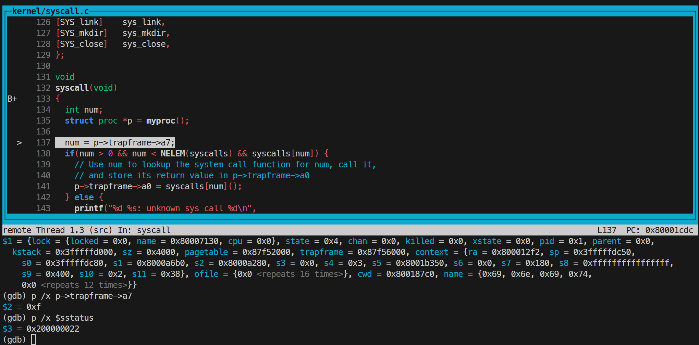
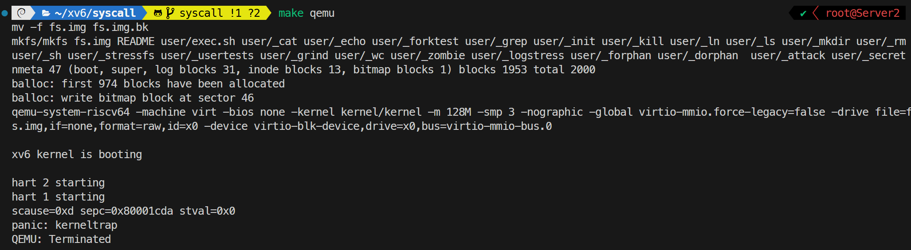
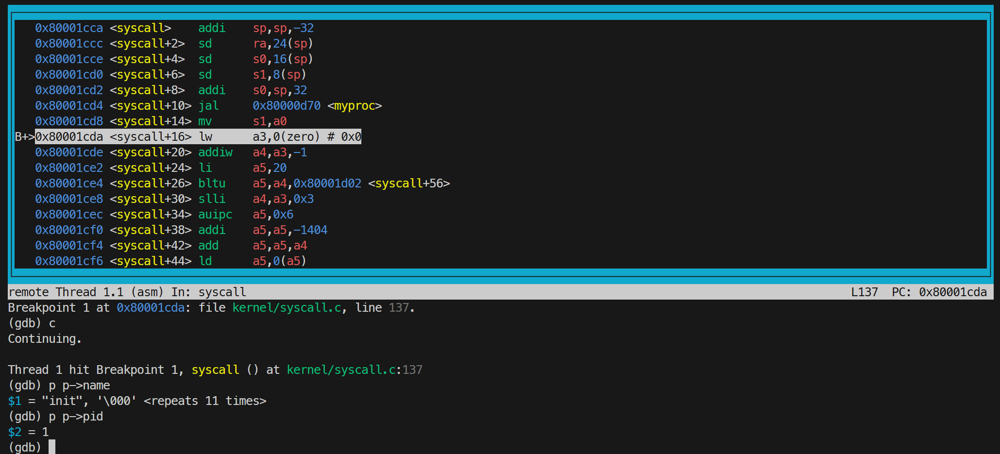
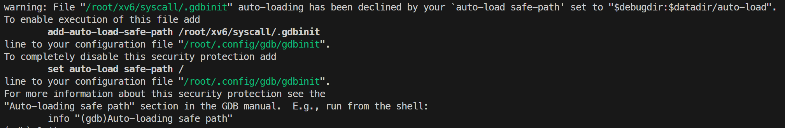
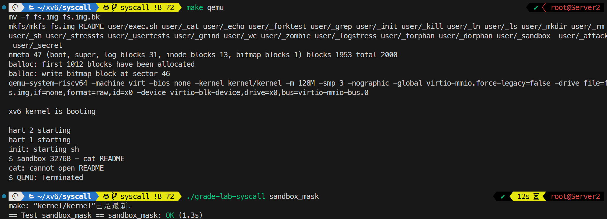
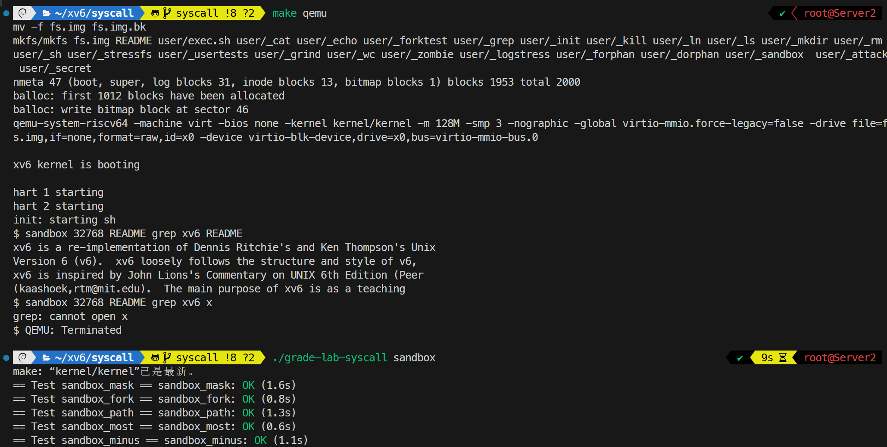
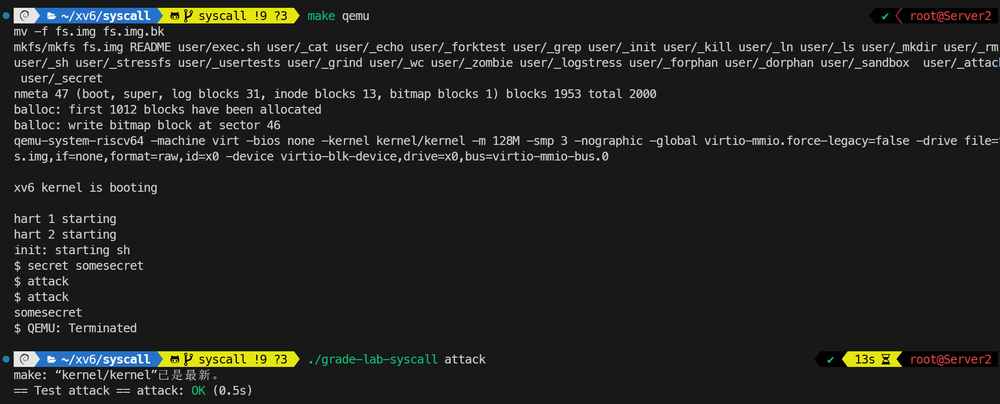
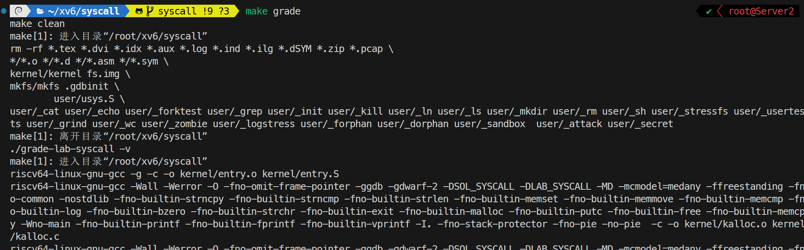
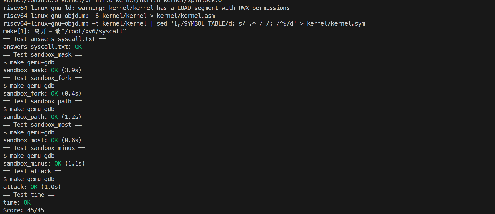

# 2. system calls

## Using gdb

### 要求

使用 GDB 调试 xv6 内核。分别启动 `make qemu-gdb` 和 GDB，在 `syscall()` 处设置断点，通过源码布局、单步执行、栈回溯以及查看进程结构和寄存器，分析系统调用的调用过程、系统调用号及进入内核前的 CPU 特权级别。

随后将 `syscall()` 中读取系统调用号的语句临时改为空指针解引用，人为触发内核错误。根据 panic 输出中的 `sepc` 和 `scause`，结合 `kernel/kernel.asm` 与 GDB 定位故障指令、对应寄存器和异常原因，并确定发生异常时正在运行的进程名称及 PID。将各问题的答案记录在 `answers-syscall.txt` 中。

### 内容

在一个终端中执行 `make qemu-gdb`，再在另一个终端中启动 GDB，设置 `syscall()` 断点并继续运行：

```text
(gdb) b syscall
(gdb) c
(gdb) layout src
(gdb) backtrace
```

GDB 在 `kernel/syscall.c` 中的 `syscall()` 函数处停止。`backtrace` 显示其上一层调用来自 `kernel/trap.c` 中的 `usertrap()`，说明用户程序触发系统调用后，陷入内核并由 `usertrap()` 调用 `syscall()` 进行分发。

使用 `n` 单步执行至 `struct proc *p = myproc();` 之后，通过以下命令查看当前进程结构、系统调用号和 `sstatus` 寄存器：

```text
(gdb) p /x *p
(gdb) p /x p->trapframe->a7
(gdb) p /x $sstatus
```

此时 `p->trapframe->a7` 的值为 `0xf` 即 15。根据 `kernel/syscall.h`，15 对应 `SYS_open`，表示首个用户进程 `init` 正在执行 `open()` 系统调用。`sstatus` 的值为 `0x200000022`，其中第 8 位 SPP 为 0，表示发生陷阱前 CPU 运行在用户模式。



为观察内核页错误，将 `kernel/syscall.c` 中读取系统调用号的语句临时修改为：

```c
num = *(int *)0;
```

重新执行 `make qemu` 后，内核输出 `scause`、`sepc` 和 `stval`，随后发生 `panic: kerneltrap`。在本次构建生成的 `kernel/kernel.asm` 中搜索 `sepc` 的值 `0x80001cda`，找到对应汇编指令：

```asm
80001cda: 00002683 lw a3,0(zero) # 0 <_entry-0x80000000>
```



退出 QEMU 后重新启动 GDB，在故障地址设置断点并切换到汇编布局：

```text
(gdb) b *0x80001cda
(gdb) layout asm
(gdb) c
```

断点处显示的指令同样为 `lw a3,0(zero)`，内核崩溃是因为 `*(int *)0` 试图访问未映射的虚拟地址 `0x0`，`scause=0xd` 即十进制 13，表示 `Load page fault`，进一步执行以下命令查看当前进程：

```text
(gdb) p p->name
(gdb) p p->pid
```

发生异常时运行的进程名为 `init`，PID 为 1。



### 遇到的问题及心得

首次使用 gdb 时出现如图所示 warning，按照提示在配置文件中添加信任后即可正常使用。



## Sandbox a command

### 要求

实现新的 `interpose(int mask, char *path)` 系统调用，用于限制调用进程能够使用的系统调用。`mask` 的第 `n` 位对应编号为 `n` 的系统调用；某一位为 1 时，内核应拒绝对应的系统调用并返回 `-1`。本题暂不使用 `path` 参数，调用时固定传入 `"-"`。

进程设置的系统调用掩码需要由 `fork()` 创建的子进程继承，使限制在子进程执行新程序后仍然有效。完成实现后，使用提供的 `sandbox` 用户程序运行受限命令，并通过 `./grade-lab-syscall sandbox_mask` 测试。

### 内容

首先在 `Makefile` 的 `UPROGS` 中加入 `$U/_sandbox`。为了让用户程序能够调用新的系统调用，在 `kernel/syscall.h` 中分配系统调用号，并分别在 `user/user.h` 和 `user/usys.pl` 中添加函数声明和用户态入口：

```c
// kernel/syscall.h
#define SYS_interpose 22

// user/user.h
int interpose(int, char *);

// user/usys.pl
entry("interpose");
```

构建时，`user/usys.pl` 会生成使用 RISC-V `ecall` 指令进入内核的汇编桩。内核侧在 `kernel/syscall.c` 中声明 `sys_interpose()`，并将其加入 `syscalls` 数组，使编号 22 能够分发到对应的处理函数：

```c
extern uint64 sys_interpose(void);

static uint64 (*syscalls[])(void) = {
    // 其他系统调用省略
    [SYS_interpose] sys_interpose,
};
```

在 `kernel/proc.h` 的 `struct proc` 中增加 `interpose_mask` 字段，使系统调用限制成为每个进程独立保存的状态：

```c
int interpose_mask;  // Mask of the process to interpose
```

在 `kernel/sysproc.c` 中实现 `sys_interpose()`。函数使用 `argint()` 取得第一个参数，检查掩码范围后，将其记录到当前进程结构中。本题的路径参数固定为 `"-"`，暂不参与处理：

```c
int sys_interpose(void)
{
    int mask;
    argint(0, &mask);
    if (mask < 0 || mask > 0xFFFF)
        return -1;

    struct proc *p = myproc();
    p->interpose_mask = mask;
    return 0;
}
```

为了让限制能够传递给子进程，在 `kernel/proc.c` 的 `kfork()` 中复制父进程的掩码：

```c
np->interpose_mask = p->interpose_mask;
```

最后修改 `kernel/syscall.c` 中的 `syscall()`。取得系统调用号后，使用 `1 << num` 得到该系统调用对应的位；如果该位存在于当前进程的掩码中，则不调用实际的系统调用处理函数，直接将返回值寄存器 `a0` 设为 `-1`：

```c
if (num > 0 && num < NELEM(syscalls) && syscalls[num]) {
    if ((p->interpose_mask & (1 << num)) != 0) {
        p->trapframe->a0 = -1;
    } else {
        p->trapframe->a0 = syscalls[num]();
    }
} else {
    printf("%d %s: unknown sys call %d\n", p->pid, p->name, num);
    p->trapframe->a0 = -1;
}
```

`sandbox` 在子进程中调用 `interpose()`，然后通过 `exec()` 运行目标程序。由于 `exec()` 不会更换当前的 `struct proc`，掩码在新程序中继续生效；若该程序再次调用 `fork()`，`kfork()` 也会把掩码复制给下一代子进程。

在 xv6 shell 中执行 `sandbox 32768 - cat README`，以及在宿主机执行 `./grade-lab-syscall sandbox_mask` 单项测试。



### 遇到的问题及心得

本题未遇到问题。

## Sandbox with allowed pathnames

### 要求

扩展 `interpose()` 系统调用，使其第二个参数表示允许访问的路径。当 `open` 或 `exec` 被掩码限制时，若该系统调用使用的路径与允许路径完全相同，则内核仍应放行；其他路径仍返回失败。允许路径与系统调用掩码一样，需要由 `fork()` 创建的子进程继承。

### 内容

在 `kernel/proc.h` 的 `struct proc` 中增加长度为 `MAXPATH` 的字符数组，用于为每个进程保存允许路径：

```c
char interpose_buffer[MAXPATH];
```

修改 `kernel/sysproc.c` 中的 `sys_interpose()`。保存掩码后，使用 `argstr()` 读取第二个系统调用参数，并将路径复制到当前进程的缓冲区中：

```c
int sys_interpose(void)
{
    int mask;
    argint(0, &mask);
    if (mask < 0 || mask > 0xFFFF)
        return -1;

    struct proc *p = myproc();
    p->interpose_mask = mask;
    argstr(1, p->interpose_buffer, MAXPATH);
    return 0;
}
```

在 `kfork()` 中除了复制掩码，还使用 `safestrcpy()` 将允许路径复制给子进程，从而保证通过 shell 等程序创建的后续进程继续受到相同限制：

```c
np->interpose_mask = p->interpose_mask;
safestrcpy(np->interpose_buffer, p->interpose_buffer, MAXPATH);
```

最后扩展 `syscall()` 中的拦截逻辑。系统调用被掩码命中时，默认不允许执行；只有系统调用为 `SYS_open` 或 `SYS_exec`，并且其第一个参数中的路径与进程保存的允许路径一致时，才将 `allow` 置为 1。路径不匹配以及其他被掩码限制的系统调用均直接返回 -1：

```c
if ((p->interpose_mask & (1 << num)) != 0) {
    int allow = 0;
    if (num == SYS_open || num == SYS_exec) {
        char path[MAXPATH];
        if (argstr(0, path, MAXPATH) >= 0 &&
            strncmp(path, p->interpose_buffer, MAXPATH) == 0) {
            allow = 1;
        }
    }
    if (!allow) {
        p->trapframe->a0 = -1;
        return;
    }
}
p->trapframe->a0 = syscalls[num]();
```

`open()` 和 `exec()` 的第一个参数都是路径，因此可以在统一的系统调用分发入口中通过 `argstr(0, ...)` 取得。以允许路径 `README` 为例，对 `README` 的 `open()` 会继续执行实际的 `sys_open()`，而对文件 `x` 的 `open()` 会在分发前被拒绝。

在 xv6 shell 中执行 `sandbox 32768 README grep xv6 README`、`sandbox 32768 README grep xv6 x`，以及在宿主机执行 `./grade-lab-syscall sandbox` 单项测试。



### 遇到的问题及心得

本题未遇到问题。

## Attack xv6

### 要求

利用 xv6 内核中故意引入的漏洞窃取另一个进程写入的秘密字符串。编译本实验时，`kernel/vm.c` 的 `uvmalloc()` 中用于清零新分配页面的 `memset(mem, 0, sz)`，以及 `kernel/kalloc.c` 中两处用于向空闲页填充垃圾数据的 `memset` 均被省略（三处都以 `#ifndef LAB_SYSCALL` 标记），因此新分配的内存会保留上一次使用时的内容。`user/secret.c` 将秘密字符串写入自己的内存后退出（内存随之被释放），要求只修改 `user/attack.c`，通过 `sbrk()` 申请内存并找到上次 `secret` 进程残留的秘密字符串。

### 内容

`secret.c` 在全局数组 `data[DATASIZE]`（8 页）中写入数据：`data` 起始处为固定字符串 `"This may help."`，`data + 16` 处为命令行参数传入的秘密字符串，随后进程 `exit()`，内核释放这 8 页内存。由于本实验省略了释放和分配时的清空、填充操作，页面内容原样保留。

`attack.c` 调用 `sbrk(DATASIZE)` 申请同样大小的内存，内核返回的页面很可能正是 `secret` 刚释放的页面，其中仍残留 `"This may help."` 和秘密字符串。实际观察发现两个程序编译后的内存布局存在固定偏移，`secret` 留下的数据整体出现在 `sbrk` 返回地址偏移 16 字节处，因此 `data[29]` 恰好是 `"This may help."` 结尾的句点，秘密字符串位于 `data + 32`。实现以此作为布局校验，校验通过时才打印秘密字符串：

```c
#define DATASIZE (8 * 4096)

int main(int argc, char* argv[])
{
    char* data = sbrk(DATASIZE);
    if (data[29] == '.') {
        printf("%s\n", data + 32);
        return 0;
    }
    else {
        return 1;
    }
}
```

若页面布局与预期不符（例如内存未被复用），则返回非零退出码，等待 grader 第二次运行 `attack` 时再次尝试。

在 xv6 shell 中执行 `secret somesecret`、`attack`，以及在宿主机执行 `./grade-lab-syscall attack` 单项测试。



### 遇到的问题及心得

一些不直接影响程序正确性的漏洞有时也会被利用来破坏安全性，看似无害的边界处理往往是安全漏洞的根源。

## 评分



