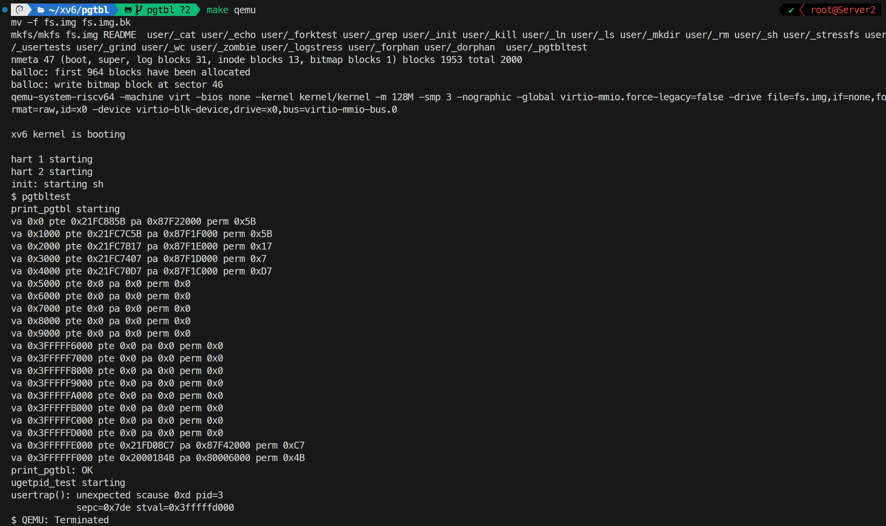
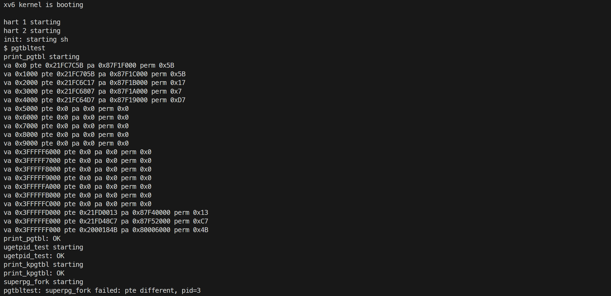
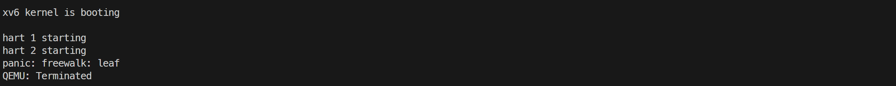
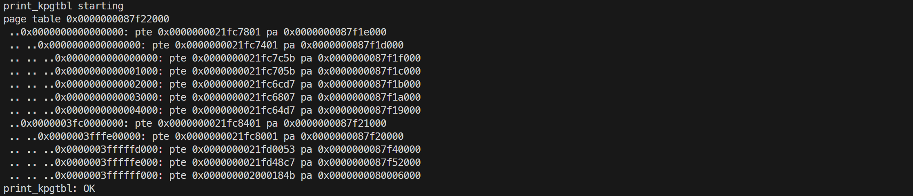
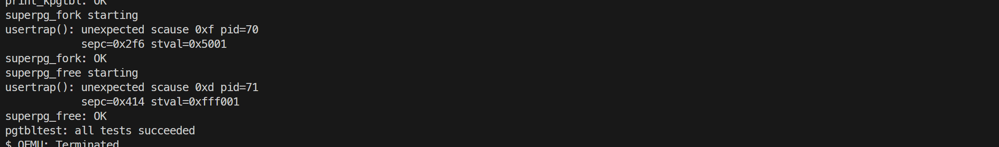
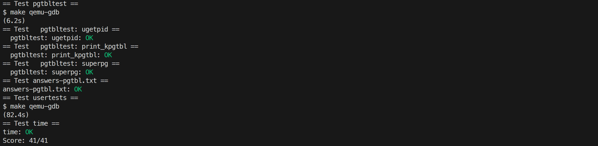

# 3. page tables

## Inspect a user-process page table

### 要求

执行用户程序 `pgtbltest`，通过实验提供的 `pgpte` 系统调用打印该进程页表前 10 个与后 10 个页表项（虚拟地址、PTE 值、物理地址、权限位）。逐项说明每个页表项的逻辑内容及权限位的含义，并解释为什么 xv6 没有把用户虚拟页连续放置在物理内存中。

### 内容

实验已提供 `pgpte` 系统调用和 `user/pgtbltest.c` 中的 `print_pgtbl()`：程序通过 `pgpte` 查询当前进程页表中指定虚拟地址的页表项，并打印前 10 个与后 10 个页表项的虚拟地址、PTE 值、物理地址和权限位。

运行 `make qemu` 后，在 xv6 shell 中执行 `pgtbltest`，`print_pgtbl` 的输出如图。



对每条页表项的解释：

```
va 0x0 pte 0x21FC885B pa 0x87F22000 perm 0x5B
代码段，权限为 AUXRV，已访问过，用户态可访问，可执行，可读，有效
va 0x1000 pte 0x21FC7C5B pa 0x87F1F000 perm 0x5B
代码段，权限为 AUXRV，已访问过，用户态可访问，可执行，可读，有效
va 0x2000 pte 0x21FC7817 pa 0x87F1E000 perm 0x17
数据段，权限为 UWRV，用户态可访问，可写，可读，有效
va 0x3000 pte 0x21FC7407 pa 0x87F1D000 perm 0x7
保护页，权限为 WRV，可写，可读，有效
va 0x4000 pte 0x21FC70D7 pa 0x87F1C000 perm 0xD7
用户栈，权限为 DAUWRV，已写入过，已访问过，用户态可访问，可写，可读，有效
（中间大量 0x0 为未映射页）
va 0x3FFFFFE000 pte 0x21FD08C7 pa 0x87F42000 perm 0xC7
陷阱帧，权限为 DAWRV，已写入过，已访问过，可写，可读，有效
va 0x3FFFFFF000 pte 0x2000184B pa 0x80006000 perm 0x4B
蹦床页，权限为 AXRV，已访问过，可执行，可读，有效
```

PTE 的高位存放物理页号，低 10 位是权限标志：`PTE_V` 表示映射有效，`PTE_R`/`PTE_W`/`PTE_X` 分别表示可读/可写/可执行，`PTE_U` 表示用户态可访问，`PTE_A`（已访问）与 `PTE_D`（已写）由硬件在访问或写入页面时自动置位。打印中的 `pa` 即 `PTE2PA(pte)`，把 PTE 中的物理页号左移 12 位还原得到物理地址。

代码段与栈页的 `perm` 中含 A 位，说明程序已开始执行、栈已被使用；栈页还有 D 位，说明栈发生过写入。数据段页没有 A/D 位，因为打印发生在程序访问该页之前。保护页、trapframe 与 trampoline 都没有 PTE_U：保护页的作用是当栈向低地址溢出时立即触发缺页异常；trapframe 与 trampoline 属于内核数据与代码，用户态不允许访问，其中 trampoline 因需要在陷入和返回时执行而带有 X 位。

### 遇到的问题及心得

虚拟页对应的物理地址并不连续，用户进程的代码、数据、栈和 trapframe 是在 exec 与内存分配过程中多次调用 `kalloc()` 独立分配的，xv6 通过页表把这些分散的物理页映射到连续的虚拟地址空间。蹦床页映射到内核镜像中的同一物理页，位于内核所在低地址区域，从而实现用户态与内核态对该页的共享。

## Speed up system calls

### 要求

实现 `getpid()` 的共享页优化：每个进程创建时在 `USYSCALL` 虚拟地址映射一个只读页，页首存放 `struct usyscall` 并写入当前进程的 PID，使用户态 `ugetpid()` 无需陷入内核即可直接读取 PID。参考 `kernel/proc.c` 中 trapframe 页的处理，完成共享页的分配、初始化、映射与释放等生命周期管理，权限位只允许用户态读。此外说明还有哪些 xv6 系统调用可借助这种共享页加速及其原因。

### 内容

在 `kernel/proc.h` 的 `struct proc` 中加入指针字段，保存每个进程的共享页：

```c
struct usyscall* usyscall;
```

`struct usyscall` 由实验定义在 `kernel/memlayout.h` 中，仅含一个 `int pid` 字段；`USYSCALL` 的地址为 `TRAPFRAME - PGSIZE`，位于用户地址空间最高处、trapframe 页的正下方。

参照 trapframe 页的生命周期，分四个环节处理该共享页：

1. 分配：在 `allocproc()` 中通过 `kalloc()` 分配一页并赋给 `p->usyscall`，分配失败时调用 `freeproc()` 并返回；
2. 初始化：在 `allocproc()` 末尾写入 `p->usyscall->pid = p->pid;`，使 `fork()` 创建的子进程也拥有自己正确的 PID；
3. 映射：在 `proc_pagetable()` 中把该页映射到 `USYSCALL`，权限取 `PTE_R | PTE_U`（只读、用户态可读，不设置 `PTE_W`）；
4. 释放：在 `proc_freepagetable()` 中 `uvmunmap` 解除映射，在 `freeproc()` 中 `kfree()` 释放页面。

```c
// allocproc()：分配并初始化
if ((p->usyscall = (struct usyscall*)kalloc()) == 0) {
    freeproc(p);
    release(&p->lock);
    return 0;
}
...
p->usyscall->pid = p->pid;

// proc_pagetable()：映射共享页
if (mappages(pagetable, USYSCALL, PGSIZE, (uint64)(p->usyscall),
             PTE_R | PTE_U) < 0) {
    uvmunmap(pagetable, TRAMPOLINE, 1, 0);
    uvmunmap(pagetable, TRAPFRAME, 1, 0);
    uvmfree(pagetable, 0);
    return 0;
}

// proc_freepagetable()：解除映射
uvmunmap(pagetable, USYSCALL, 1, 0);

// freeproc()：释放页面
if (p->usyscall)
    kfree((void*)p->usyscall);
p->usyscall = 0;
```

用户态侧的 `ugetpid()` 已由实验提供（`user/ulib.c`），它直接把 `USYSCALL` 地址解释为 `struct usyscall *` 并读取 `pid` 字段，全程不发生系统调用：

```c
int
ugetpid(void)
{
  struct usyscall *u = (struct usyscall *)USYSCALL;
  return u->pid;
}
```

除 `getpid()` 外，`uptime()` 也可用共享页加速，它返回内核的 ticks 计数，若内核在时钟中断时把最新 ticks 写入共享页，用户态直接读取即可，无需系统调用。

在 xv6 shell 中执行 `pgtbltest`，观察 `ugetpid_test: OK`。



### 遇到的问题及心得

在 `proc_pagetable()` 中完成 `USYSCALL` 映射后，执行 `make qemu` 启动系统时出现 `panic: freewalk: leaf`。原因是 `proc_freepagetable()` 只解映射了 `TRAMPOLINE` 和 `TRAPFRAME`，而 `freewalk()` 要求调用 `uvmfree()` 之前所有叶子页都已解映射，残留的 `USYSCALL` 映射使 `freewalk()` 在清理页表树时遇到叶子页而崩溃。在 `proc_freepagetable()` 中加入 `uvmunmap(pagetable, USYSCALL, 1, 0)`，并在 `freeproc()` 中释放 `p->usyscall` 物理页后恢复正常。新增映射时要同步考虑它的完整生命周期。



## Print a page table

### 要求

实现 `kernel/vm.c` 中的 `vmprint()`：递归打印给定页表，第一行输出页表地址，之后每个有效 PTE 一行，按所在层级用 ` ..` 缩进，依次显示虚拟地址、PTE 值和物理地址；指向下一级页表的中间项继续递归，无效 PTE 不打印。通过实验提供的 `kpgtbl()` 系统调用运行 `print_kpgtbl()` 测试，并解释输出中每个叶子页的逻辑内容、权限位及其与第一题 `print_pgtbl()` 输出的关系。

### 内容

实验提供了 `kpgtbl` 系统调用（`SYS_kpgtbl`，编号 34），`sys_kpgtbl()` 取得当前进程的页表并调用 `vmprint(p->pagetable)`；`user/pgtbltest.c` 中的 `print_kpgtbl()` 调用用户态入口 `kpgtbl()` 触发打印。需要实现的是 `kernel/vm.c` 中的 `vmprint()`。

实现采用递归遍历。`vmprint()` 先打印页表自身的地址，再由辅助函数从根页表开始逐项处理：对每个有效 PTE 输出一行（缩进 `level` 个 ` ..`，虚拟地址由基地址拼接该索引对应的位段得到）；若该 PTE 未设置 R/W/X 权限，说明它是指向下一级页表的中间项，递归进入其指向的页表页；叶子页则不再递归：

```c
void vmprint_helper(pagetable_t pagetable, int level, uint64 base_va)
{
    int shift = 12 + (3 - level) * 9;

    for (int i = 0; i < 512; i++) {
        pte_t pte = pagetable[i];
        if (pte & PTE_V) {
            uint64 pa = PTE2PA(pte);
            int flags = PTE_FLAGS(pte);
            uint64 va = base_va | ((uint64)i << shift);
            for (int j = 0; j < level; j++) {
                printf(" ..");
            }
            printf("%p: pte %p pa %p\n", (void*)va, (void*)pte, (void*)pa);
            if ((flags & (PTE_R | PTE_W | PTE_X)) == 0) {
                vmprint_helper((pagetable_t)pa, level + 1, va);
            }
        }
    }
}

void vmprint(pagetable_t pagetable)
{
    printf("page table %p\n", pagetable);
    vmprint_helper(pagetable, 1, 0);
}
```

`shift = 12 + (3 - level) * 9` 对应 Sv39 三级页表中各层索引在虚拟地址中的位段（根层 30 位、中层 21 位、叶子层 12 位），因此每一层都能还原出完整的虚拟地址。判断叶子页的条件与 `freewalk()` 一致：PTE 带 R/W/X 是叶子映射，只有 V 位（无 R/W/X）的项才是指向下级页表的指针；递归深度固定为 3，不会无限递归。

运行 `pgtbltest`，`print_kpgtbl()` 的输出如图。



根层只有两个有效项：索引 0 对应低地址区（用户程序内存），索引 255 对应高地址区（`0x3fc0000000` 起，`MAXVA` 之下）。每个非叶子项（pte 仅含 V 位）指向一张下级页表页：低地址区二级页表只有索引 0，高地址区二级页表只有索引 511。

该输出与第一题 `print_pgtbl()` 查看的是同一个 `pgtbltest` 进程的页表，区别在于：`print_pgtbl()` 通过 `pgpte` 只取前 10 与后 10 个页的叶子 PTE 平铺打印；`vmprint()` 则递归遍历整棵页表树，额外显示出两级中间页表项，能直观看到页表的分层结构。相同虚拟地址的叶子项在两次输出中逻辑内容一致，权限位差异只源于执行时机：`print_kpgtbl()` 在 `ugetpid_test()` 之后运行，数据页已被访问写入（`0x17` 变为 `0xD7`）。此外，第一题记录输出时 `USYSCALL` 页尚未映射，完成第二题后该页以只读项（`0x53`）出现在 `vmprint()` 中。

### 遇到的问题及心得

本题未遇到问题。

## Use superpages

### 要求

实现 xv6 的超页（2MB megapage）支持：当 `sbrk()` 的申请大小不小于 2MB，且新地址范围中存在 2MB 对齐、大小不小于 2MB 的区域时，用单个超页代替数百个普通 4KB 页。为此需在 `kalloc.c` 中预留若干 2MB 物理块并提供 `superalloc()/superfree()`，修改 `uvmalloc()` 分配超页、`uvmcopy()` 在 fork 时复制超页、`uvmunmap()` 在释放时处理超页（部分释放时降级为普通页）。

### 内容

在 `kernel/kalloc.c` 中预留若干 2MB 物理块（`SUPERPGNUM`，需保证父、子进程同时持有超页时数量足够），从物理内存顶部 `SUPERPGSTART = PHYSTOP - SUPERPGNUM * SUPERPGSIZE` 开始划分，普通页只分配到 `SUPERPGSTART` 之前：

```c
#define SUPERPGSTART (PHYSTOP - SUPERPGNUM * SUPERPGSIZE)

void
kinit()
{
  initlock(&kmem.lock, "kmem");
  freerange(end, (void*)SUPERPGSTART);
  initlock(&super_kmem.lock, "super_kmem");
  for (uint64 p = SUPERPGSTART; p < PHYSTOP; p += SUPERPGSIZE) {
      superfree((void*)p);
  }
}
```

`superfree()` 校验 2MB 对齐与范围后把物理块链入 `super_kmem` 空闲链表；`superalloc()` 从链上取出一个块并清零后返回：

```c
void superfree(void* pa)
{
    if (((uint64)pa % SUPERPGSIZE) != 0 ||
        (char*)pa < end || (uint64)pa >= PHYSTOP)
        panic("superfree: not aligned or out of range");

    memset(pa, 1, SUPERPGSIZE);
    struct run_super* r = (struct run_super*)pa;
    acquire(&super_kmem.lock);
    r->next = super_kmem.freelist;
    super_kmem.freelist = r;
    release(&super_kmem.lock);
}

void* superalloc(void)
{
    acquire(&super_kmem.lock);
    struct run_super* r = super_kmem.freelist;
    if (r)
        super_kmem.freelist = r->next;
    release(&super_kmem.lock);
    if (r)
        memset((char*)r, 0, SUPERPGSIZE);
    return (void*)r;
}
```

`kernel/vm.c` 新增 `mappages_super()`：根层（level-2）若尚无对应中间页表则先补建一页，再直接写 level-1 项形成超页映射：

```c
int mappages_super(pagetable_t pagetable, uint64 va, uint64 pa, int perm)
{
    if (va % SUPERPGSIZE != 0 || pa % SUPERPGSIZE != 0)
        panic("mappages_super: not aligned");

    pagetable_t pgt = pagetable;
    pte_t* pte = &pgt[PX(2, va)];
    if ((*pte & PTE_V) == 0) {
        pagetable_t new_pt = (pagetable_t)kalloc();
        if (new_pt == 0)
            return -1;
        memset(new_pt, 0, PGSIZE);
        *pte = PA2PTE(new_pt) | PTE_V;
    }
    pgt = (pagetable_t)PTE2PA(*pte);
    pte = &pgt[PX(1, va)];
    if (*pte & PTE_V)
        panic("mappages_super: remap");
    *pte = PA2PTE(pa) | perm | PTE_V;
    return 0;
}
```

`walk()` ：当 level-1 项已带 R/W/X（超页叶子）时直接返回该项，不再向 level-0 下钻，使 `pgpte`、`uvmunmap` 等调用方能正确识别超页。

`walkaddr()` 也做了相应修改：对 level-1 超页项，在 `PTE2PA` 的基础上补上 2MB 内的偏移，保证 copyin/copyout 等通过 `walkaddr` 访问超页区域时得到正确的物理地址。

`uvmalloc()` 在增长进程内存时，遇到 2MB 对齐且剩余长度不小于 2MB 的区间优先分配超页，否则退回普通 4KB 页逐页分配：

```c
  for (a = oldsz; a < newsz; a += sz) {
      sz = PGSIZE;
      if ((a % SUPERPGSIZE == 0) && (newsz - a >= SUPERPGSIZE)) {
          void* smem = superalloc();
          if (smem != 0) {
              if (mappages_super(pagetable, a, (uint64)smem,
                                 PTE_R | PTE_U | xperm) == 0) {
                  sz = SUPERPGSIZE;
                  continue;
              }
              superfree(smem);
          }
      }
      mem = kalloc();
      if (mem == 0) {
          uvmdealloc(pagetable, a, oldsz);
          return 0;
      }
      memset(mem, 0, sz);
      if (mappages(pagetable, a, sz, (uint64)mem, PTE_R | PTE_U | xperm) != 0) {
          kfree(mem);
          uvmdealloc(pagetable, a, oldsz);
          return 0;
      }
  }
```

`uvmcopy()` 在 fork 时复制页表：若当前 PTE 是 level-1 超页（与普通 4KB 叶子页区分），则 `superalloc()` 一块 2MB 内存、`memmove` 整块复制，用 `mappages_super()` 映射到子进程相同虚拟地址并跳过整个 2MB；普通页仍按原逻辑逐页复制。区分方法是检查 `walk()` 返回的 PTE 是否就是 level-1 项：

```c
    pagetable_t l1 = (pagetable_t)PTE2PA(old[PX(2, i)]);
    if (pte == &l1[PX(1, i)]) {
        // 2MB superpage
        if ((mem = superalloc()) == 0)
            goto err;
        memmove(mem, (char*)pa, SUPERPGSIZE);
        if (mappages_super(new, i, (uint64)mem, flags) != 0) {
            superfree(mem);
            goto err;
        }
        szinc = SUPERPGSIZE;
        continue;
    }
```

`uvmunmap()` 处理超页释放：对 level-1 超页项，若本次解映射范围完整覆盖整个 2MB，则 `superfree()` 归还物理块并清除 PTE；若只是部分释放（例如 `sbrk(-PGSIZE)` 释放超页末尾 4096 字节），则先 `demote_superpage()` 降级为普通页再逐个解映射：

```c
        pagetable_t l1 = (pagetable_t)PTE2PA(pagetable[PX(2, a)]);
        if (pte == &l1[PX(1, a)]) {
            if ((a % SUPERPGSIZE == 0) &&
                (va + npages * PGSIZE - a >= SUPERPGSIZE)) {
                sz = SUPERPGSIZE;
                if (do_free)
                    superfree((void*)PTE2PA(*pte));
                *pte = 0;
                continue;
            } else {
                demote_superpage(pagetable, a);
                pte = walk(pagetable, a, 0);
            }
        }
        if (do_free)
            kfree((void*)PTE2PA(*pte));
        *pte = 0;
```

`demote_superpage()` 分配一张 level-0 页表，把 2MB 物理块按 4KB 粒度填满原权限位，并用该页表替换原 level-1 超页项，使剩余内存仍可访问：

```c
void demote_superpage(pagetable_t pagetable, uint64 va)
{
    pte_t* pte1 = walk(pagetable, va, 0);
    if (pte1 == 0 || (*pte1 & PTE_V) == 0 ||
        !(*pte1 & (PTE_R | PTE_W | PTE_X)))
        panic("demote_superpage: invalid pte");

    uint64 pa_super = PTE2PA(*pte1);
    int perm = PTE_FLAGS(*pte1);

    pagetable_t l0_pt = (pagetable_t)kalloc();
    if (l0_pt == 0)
        panic("demote: kalloc failed");
    memset(l0_pt, 0, PGSIZE);

    for (int i = 0; i < 512; i++)
        l0_pt[i] = PA2PTE(pa_super + i * PGSIZE) | perm;

    *pte1 = PA2PTE(l0_pt) | PTE_V;
}
```

`superpg_fork` 验证 `sbrk(16MB)` 后父进程地址空间中连续 512 页共享同一条超页 PTE、fork 后子进程同样持有超页、`sbrk(-SZ)` 释放后子进程访问已释放内存会被缺页 kill；`superpg_free` 验证 `sbrk(-PGSIZE)` 部分释放超页后其余内容保留、剩余页仍为超页映射、fork 出的子进程不能访问父进程已释放的页。

在 xv6 shell 中执行 `pgtbltest`。



### 遇到的问题及心得

实现过程中排查了三个问题：初期启动即 `panic: freewalk: leaf`，原因是 `uvmcopy()` 用 R/W/X 判断超页，而普通叶子页同样带 R/W/X，被误当成 2MB 超页复制，导致 fork 出的子进程页表损坏，改为判断 PTE 是否位于 level-1 后解决。随后 `superpg_fork` 报 `pte wrong`，是 `uvmalloc()` 的超页分支只传了 `PTE_W`，超页 PTE 缺少 `PTE_R`，补上 `PTE_R | PTE_U` 后通过。最后 fork 失败，原因是一开始设置的 `#define SUPERPGNUM 8` 不足以同时满足父进程与 fork 复制后的子进程（各占 7 个超页），调整为 16 后通过。

## 评分


