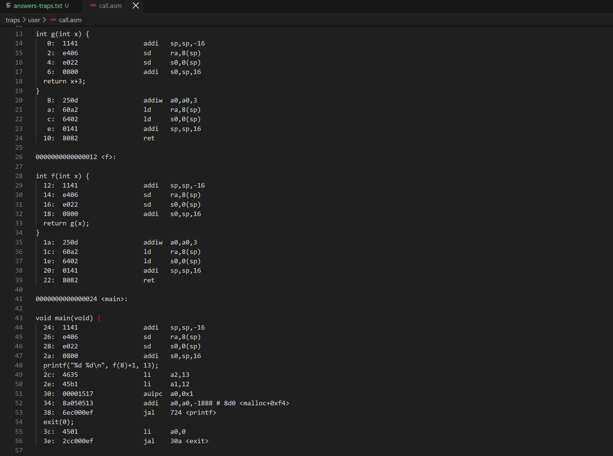
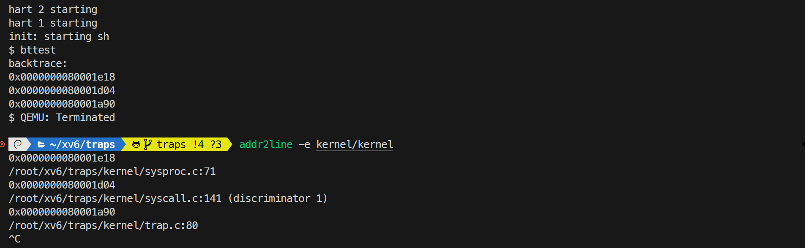
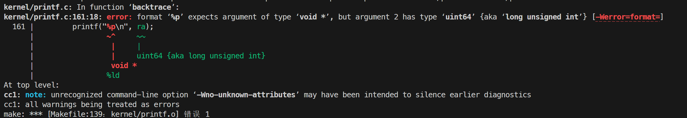
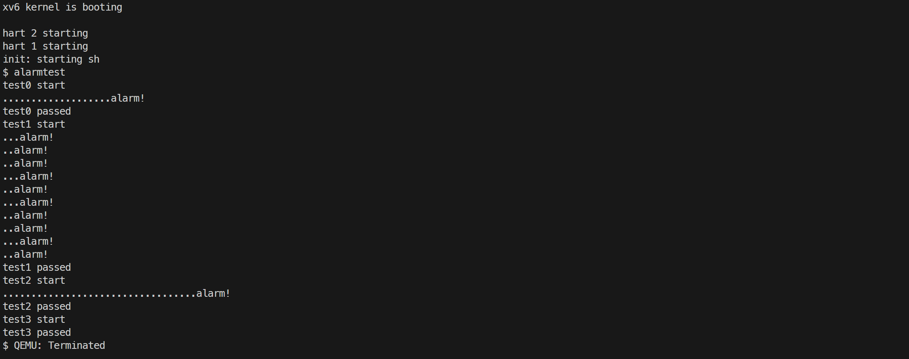
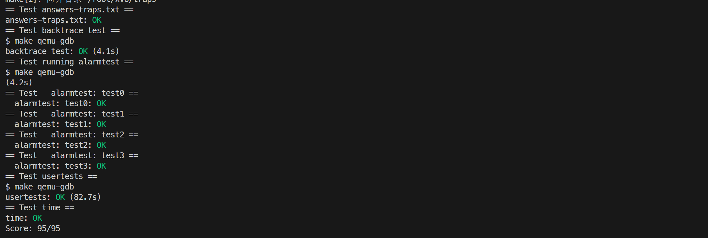

# 4. traps

## RISC-V assembly

### 要求

阅读 `user/call.c` 编译生成的汇编文件 `user/call.asm`，结合 RISC-V 函数调用约定，回答问题：

哪些寄存器用于传递函数参数？例如，在 main 调用 printf 时，哪个寄存器保存了数值 13？

在 main 的汇编代码中，对函数 f 的调用在哪？对函数 g 的调用在哪？

函数 printf 位于什么地址？

在 main 中执行跳转到 printf 的 jalr 指令刚结束时，寄存器 ra 中的值是什么？

运行以下代码，输出是什么？输出取决于 RISC-V 是小端序这一事实。如果 RISC-V 是大端序，为了产生相同的输出，你需要将 i 设置为什么值？你需要将 57616 改为不同的值吗？

```c
unsigned int i = 0x00646c72;
printf("H%x Wo%s", 57616, (char *) &i);
```

在以下代码中，y= 之后会打印出什么？（注意：答案不是一个具体的数值。）为什么会发生这种情况？

```c
printf("x=%d y=%d", 3);
```

### 内容

执行 `make fs.img` 会编译 `user/call.c` 并生成可读汇编文件 `user/call.asm`。



回答如下：

寄存器 a0-a7 保存函数参数，在 main 函数调用 printf 时，a2 保存了参数 13（第三个参数）

main 函数的汇编代码中，没有出现函数 f、g 的调用，编译器直接将 f(8)+1 处理为了立即数 12

printf 函数位于地址 0x724

main 函数中调用 printf 函数之后，寄存器 ra 的值是 0x3c，即 printf 执行完成后返回原函数的地址

输出结果是 HE110 World，57616 对应十六进制值 0xe110，小端序的 0x00646c72 按 char 逐字符解析得到 rld，大端序情况下 i 应设置为 0x726c6400，不需要更改 57616

会打印一个不可预期值，根据调用约定，printf 会去寄存器 a2 中找格式串需要但实际并未传递的参数

### 遇到的问题及心得

本题未遇到问题。

## Backtrace

### 要求

实现 `kernel/printf.c` 中的 `backtrace()` 函数：利用 RISC-V 栈帧中的帧指针（寄存器 `s0`）沿调用链逐帧向上遍历，打印每个栈帧保存的返回地址；在 `sys_pause` 中调用 `backtrace()`；在 `panic` 中调用 `backtrace()`，使内核崩溃时也能输出调用栈。

### 内容

RISC-V 中每次函数调用都会在栈上建立栈帧，fp 指向栈帧的基准位置；`fp[-1]` 是调用完当前函数后，CPU 应该跳回的指令地址 ra；`fp[-2]` 是指向上一个函数（调用者）的 fp。通过不断执行 `fp = (uint64*)fp[-2]`，一层层向上回溯所有的函数调用栈。

每个内核栈只占用一页，所有栈帧都位于同一页内，因此遍历时可用 `PGROUNDDOWN(fp)` 判断帧指针是否仍在本页，越界即表示到达栈顶。

实现步骤如下：

1. 在 `kernel/riscv.h` 中添加用内联汇编读取当前帧指针 `s0` 的函数。

```c
static inline uint64 r_fp()
{
    uint64 x;
    asm volatile("mv %0, s0" : "=r"(x));
    return x;
}
```

2. 在 `kernel/defs.h` 中声明原型 `void backtrace(void);`。
3. 在 `kernel/printf.c` 中实现 `backtrace()`。

```c
void backtrace(void)
{
    uint64* fp = (uint64*)r_fp();
    uint64 top = PGROUNDUP((uint64)fp);
    uint64 bottom = PGROUNDDOWN((uint64)fp);
    printf("backtrace:\n");
    while ((uint64)fp >= bottom && (uint64)fp < top) {
        uint64 ra = fp[-1];
        printf("%p\n", (void*)ra);
        fp = (uint64*)fp[-2];
    }
}
```

从当前帧指针开始，每次打印 `fp[-1]`，再通过 `fp[-2]` 跳到上一个栈帧；当 `fp` 超出本页范围时停止。

4. 在 `kernel/sysproc.c` 的 `sys_pause()` 开头调用 `backtrace()`，`bttest` 通过 `pause(1)` 进入该系统调用从而触发回溯。

运行 `bttest` 验证，并将地址粘贴给 `addr2line -e kernel/kernel`，还原为 `kernel/sysproc.c`、`kernel/syscall.c`、`kernel/trap.c` 等源文件行号。



### 遇到的问题及心得

本题实现时意外遇到如图所示的 printf 编译报错，原因为格式化占位符 %p 要求传入指针类型，而 ra 变量定义为了 uint64，类型不匹配，添加 `(void *)` 强制类型转换即可。



## Alarm

### 要求

新增 `sigalarm(interval, handler)` 与 `sigreturn()` 两个系统调用：进程调用 `sigalarm(n, fn)` 后，内核每隔 n 个 CPU tick 在用户态触发一次 `fn`，`fn` 返回后进程从被中断处继续执行且寄存器状态保持不变。

### 内容

`kernel/syscall.h` 中定义 `SYS_sigalarm 22`、`SYS_sigreturn 23`；`kernel/syscall.c` 中声明并注册两个处理函数；`user/user.h` 中声明 `int sigalarm(int ticks, void (*handler)());` 与 `int sigreturn(void);`；`user/usys.pl` 中加入 `entry("sigalarm")`、`entry("sigreturn")` 以生成 `usys.S` 入口；`Makefile` 的 `UPROGS` 中加入 `$U/_alarmtest`。

在 `kernel/proc.h` 的 `struct proc` 中新增字段：

```c
int alarm_interval;              // 闹钟间隔（tick 数），0 表示关闭
uint64 alarm_handler;            // 用户态 handler 地址
int alarm_ticks;                 // 距下次触发的 tick 计数
struct trapframe* saved_trapframe; // 触发时保存的中断现场
int alarm_active;                // handler 是否正在执行（防重入）
```

`allocproc()` 中将这些字段初始化为 0，并为 `saved_trapframe` 分配一页内存；`freeproc()` 中释放该页面。

`sys_sigalarm()` 通过 `argint()`、`argaddr()` 取出间隔与 handler 指针，写入 `alarm_interval`、`alarm_handler` 并把 `alarm_ticks` 清零；调用 `sigalarm(0, 0)` 时间隔为 0，即关闭闹钟。

`usertrap()` 中处理定时器中断：

```c
if (which_dev == 2) {
    if (p->alarm_interval > 0) {
        p->alarm_ticks++;
        if (p->alarm_ticks == p->alarm_interval && p->alarm_active == 0) {
            p->alarm_active = 1;
            p->alarm_ticks = 0;
            *p->saved_trapframe = *p->trapframe;
            p->trapframe->epc = p->alarm_handler;
        }
    }
    yield();
}
```

每个来自用户态的定时器中断（`which_dev == 2`）使计数加一；计数达到间隔且 handler 未在执行时，把当前 `trapframe` 整体保存到 `saved_trapframe`，并将 `trapframe->epc` 改为 handler 地址。返回用户态时 trampoline 按 `epc` 恢复 PC，进程便从 handler 开始执行；`alarm_active` 置位防止 handler 重入。随后照常 `yield()`。

`sys_sigreturn()` 用 `saved_trapframe` 整体恢复 `trapframe`（所有通用寄存器与 `epc` 全部还原），清除 `alarm_active`，并返回恢复后的 `a0`。由于系统调用分发处 `p->trapframe->a0 = syscalls[num]()` 是先求值再写回，`sigreturn` 返回的恰好是中断时保存的 `a0`，从而保证 `a0` 不被系统调用返回值覆盖。

```c
uint64 sys_sigalarm(void)
{
    int interval;
    uint64 handler;
    struct proc* p = myproc();

    argint(0, &interval);
    argaddr(1, &handler);

    p->alarm_interval = interval;
    p->alarm_handler = handler;
    p->alarm_ticks = 0;

    return 0;
}

uint64 sys_sigreturn(void)
{
    struct proc* p = myproc();
    *p->trapframe = *p->saved_trapframe;
    p->alarm_active = 0;
    return p->trapframe->a0;
}
```

运行 `alarmtest` ：



### 遇到的问题及心得

`usertrap()` 函数中，初次实现撰写了如下所示的代码：

```c
if (which_dev == 2) {
    if (p->alarm_interval > 0) {
        p->alarm_ticks++;
        if (p->alarm_ticks == p->alarm_interval && p->alarm_active == 0) {
            p->alarm_active = 1;
            p->alarm_ticks = 0;
            p->saved_trapframe = p->trapframe;
            p->trapframe->epc = p->alarm_handler;
        }
    }
    yield();
}
```

注意到 `saved_trapframe` 与 `trapframe` 都是指针变量，此处直接赋值只是让它们指向同一块内存，没有起到保存现场的作用。正确的做法是将 `trapframe` 的内容整体拷贝到 `saved_trapframe` 所指向的内存中，即 `*p->saved_trapframe = *p->trapframe;`。


