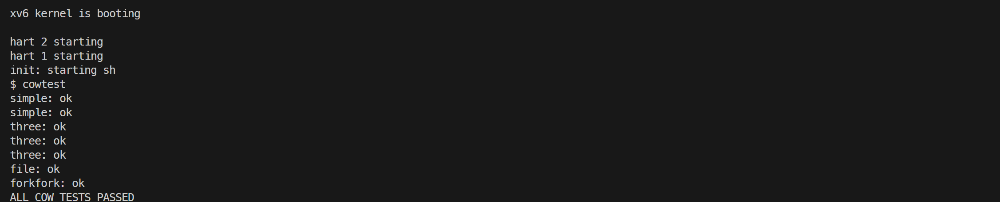
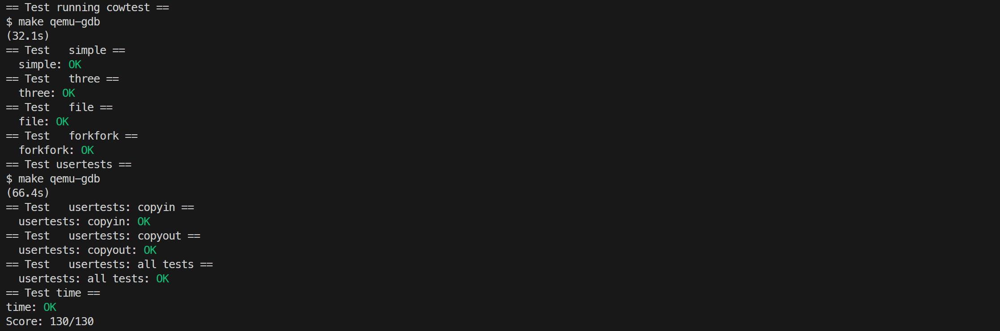

# 5. Copy-on-Write Fork for xv6

## Implement copy-on-write fork

### 要求

在 xv6 内核中实现写时复制（COW，Copy On Write）fork，将物理内存页的分配和复制推迟到实际需要时。

### 内容

未实现写时复制前，fork 会把父进程全部用户内存复制给子进程，写时复制允许 fork 只复制页表并让父子进程共享物理页，把共享页标记为只读，直到某一方真正写入时才触发缺页异常完成物理页的复制。

1. RISC-V PTE 的 bit 8 属于 RSW 位，该实验中用于记录该页是否为写时复制。在 `kernel/riscv.h` 中定义：

```c
#define PTE_COW (1L << 8)
```

2. 在 `kernel/kalloc.c` 中使用固定大小的整型数组记录每个物理页被多少个页表引用，以物理地址除以 4096 作为下标，数组大小为 `PHYSTOP / PGSIZE`：

```c
struct spinlock ref_count_lock;
int ref_count[PHYSTOP / PGSIZE];
```

`kinit()` 中初始化 `ref_count_lock`；`freerange()` 先把每页的引用计数置为 1 再调用 `kfree()`（kfree 将其减到 0 后放入空闲链表）。`kalloc()` 分配成功后把该页计数置为 1；`kfree()` 先将计数减一，若计数仍大于 0 说明页面仍被共享，直接返回而不放回空闲链表，只有减到 0 才真正释放：

```c
void kfree(void* pa)
{
    struct run* r;

    if (((uint64)pa % PGSIZE) != 0 || (char*)pa < end || (uint64)pa >= PHYSTOP)
        panic("kfree");

    acquire(&ref_count_lock);
    ref_count[(uint64)pa / PGSIZE] -= 1;
    if (ref_count[(uint64)pa / PGSIZE] > 0) {
        release(&ref_count_lock);
        return;
    }
    release(&ref_count_lock);

    // Fill with junk to catch dangling refs.
    memset(pa, 1, PGSIZE);

    r = (struct run*)pa;

    acquire(&kmem.lock);
    r->next = kmem.freelist;
    kmem.freelist = r;
    release(&kmem.lock);
}

void* kalloc(void)
{
    struct run* r;

    acquire(&kmem.lock);
    r = kmem.freelist;
    if (r)
        kmem.freelist = r->next;
    release(&kmem.lock);

    if (r) {
        memset((char*)r, 5, PGSIZE); // fill with junk
        acquire(&ref_count_lock);
        ref_count[(uint64)r / PGSIZE] = 1;
        release(&ref_count_lock);
    }
    return (void*)r;
}
```

新增 `kref_inc()`，在 fork 共享页面时调用以增加引用计数：

```c
void kref_inc(uint64 pa)
{
    acquire(&ref_count_lock);
    ref_count[pa / PGSIZE]++;
    release(&ref_count_lock);
}
```

3. 修改 `kernel/vm.c` 的 `uvmcopy()`，不再分配新页并拷贝内容，而是把父进程的物理页直接映射进子进程页表。对原本可写（`PTE_W`）的页，清除 `PTE_W` 并置上 `PTE_COW`，同时更新父进程的 PTE，使父子双方对同一物理页都只读；每次共享后调用 `kref_inc(pa)` 增加该页引用计数：

```c
int uvmcopy(pagetable_t old, pagetable_t new, uint64 sz)
{
    pte_t* pte;
    uint64 pa, i;
    uint flags;

    for (i = 0; i < sz; i += PGSIZE) {
        if ((pte = walk(old, i, 0)) == 0)
            continue; // page table entry hasn't been allocated
        if ((*pte & PTE_V) == 0)
            continue; // physical page hasn't been allocated
        pa = PTE2PA(*pte);
        flags = PTE_FLAGS(*pte);
        if (flags & PTE_W) {
            flags = (flags & ~PTE_W) | PTE_COW;
            *pte = PA2PTE(pa) | flags;
        }

        if (mappages(new, i, PGSIZE, pa, flags) != 0) {
            goto err;
        }

        kref_inc(pa);
    }
    return 0;

err:
    uvmunmap(new, 0, i / PGSIZE, 1);
    return -1;
}
```

4. `usertrap()` 中拦截 RISC-V 页错误异常，调用 `vmfault()` 处理。

`vmfault()` 当 PTE 有效且发生写缺页（read == 0）且带 `PTE_COW` 时，用 `kalloc()` 分配新页，`memmove` 复制原页内容，清除 `PTE_COW`、置上 `PTE_W` 并把 PTE 改为指向新物理地址，最后 `kfree((void*)pa)` 释放原页（实际只是把引用计数减一，仍被对方共享时不会放回空闲链表）。`kalloc()` 失败返回 0，对应进程会被 kill；原本就只读的页（如代码段，没有 `PTE_COW`）返回 0，写这类页的进程同样会被 kill：

```c
uint64 vmfault(pagetable_t pagetable, uint64 va, int read)
{
    uint64 mem;
    struct proc* p = myproc();

    if (va >= p->sz)
        return 0;
    va = PGROUNDDOWN(va);

    pte_t* pte = walk(pagetable, va, 0);
    if (pte != 0 && (*pte & PTE_V)) {
        if (read == 0 && (*pte & PTE_COW)) {
            uint64 pa = PTE2PA(*pte);
            mem = (uint64)kalloc();
            if (mem == 0) {
                return 0;
            }
            memmove((void*)mem, (void*)pa, PGSIZE);
            uint flags = PTE_FLAGS(*pte);
            flags = (flags & ~PTE_COW) | PTE_W;
            *pte = PA2PTE(mem) | flags;
            kfree((void*)pa);
            return mem;
        }
        return 0;
    }

    mem = (uint64)kalloc();
    if (mem == 0)
        return 0;
    memset((void*)mem, 0, PGSIZE);
    if (mappages(p->pagetable, va, PGSIZE, mem, PTE_W | PTE_U | PTE_R) != 0) {
        kfree((void*)mem);
        return 0;
    }
    return mem;
}
```

5. `copyout()` 用于内核向用户空间拷贝数据，目标地址所在页可能是只读的 COW 页（例如 `read` 系统调用把数据写入用户缓冲区）。修改后，当目标 PTE 只读但带 `PTE_COW` 时，先调用 `vmfault()` 完成物理页复制并把 PTE 改为可写，再执行 `memmove` 写入；若 PTE 只读且不是 COW 页（如代码段），则返回 -1：

```c
int copyout(pagetable_t pagetable, uint64 dstva, char* src, uint64 len)
{
    uint64 n, va0, pa0;
    pte_t* pte;

    while (len > 0) {
        va0 = PGROUNDDOWN(dstva);
        if (va0 >= MAXVA)
            return -1;

        pa0 = walkaddr(pagetable, va0);
        if (pa0 == 0) {
            if ((pa0 = vmfault(pagetable, va0, 0)) == 0) {
                return -1;
            }
        }

        pte = walk(pagetable, va0, 0);
        // forbid copyout over read-only user text pages.
        if ((*pte & PTE_W) == 0) {
            if (*pte & PTE_COW) {
                if ((pa0 = vmfault(pagetable, va0, 0)) == 0) {
                    return -1;
                }
            }
            else {
                return -1;
            }
        }

        n = PGSIZE - (dstva - va0);
        if (n > len)
            n = len;
        memmove((void*)(pa0 + (dstva - va0)), src, n);

        len -= n;
        src += n;
        dstva = va0 + PGSIZE;
    }
    return 0;
}
```

6. 在 xv6 shell 中执行 `cowtest`：



### 遇到的问题及心得

“任何计算机系统问题都可以通过增加一个抽象层来解决”，操作系统利用页表这一抽象，给用户进程透明地提供了连续的虚拟地址空间，写时复制 fork 进一步利用页表抽象实现了父子进程共享物理页的功能。


