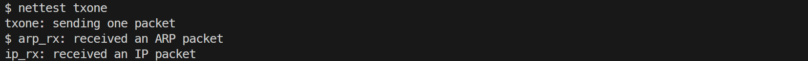
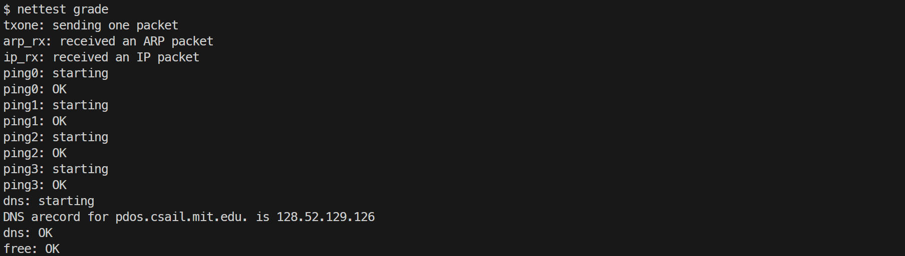
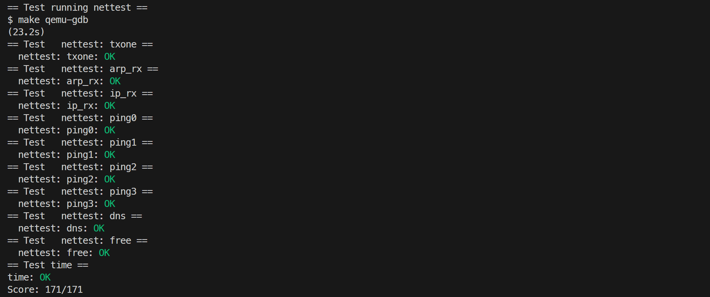

# 6. networking

## NIC

### 要求

补全 `kernel/e1000.c` 中的 `e1000_transmit()` 与 `e1000_recv()`，实现 E1000 网卡驱动的报文收发。

### 内容

E1000 通过 DMA 直接从内存中的描述符环读写报文。`e1000_init()` 已把两个环配置好，发送环的每个描述符初始 `status` 置为 `E1000_TXD_STAT_DD` 表示空闲；接收环用 `kalloc()` 为 16 个描述符各分配一个 2048 字节的缓冲区，并把 `E1000_RDT` 初始化为 `RX_RING_SIZE - 1`，使第一个到达的报文落在 0 号描述符。

实验为收发分别定义了自旋锁 `e1000_tx_lock` 和 `e1000_rx_lock`。

发送：先加锁，再读取控制寄存器 `E1000_TDT` 得到网卡期望的下一个描述符下标。若该描述符的 `status` 中没有 `E1000_TXD_STAT_DD`，说明上一次发送尚未完成，返回 -1。否则先释放该描述符里上次发送遗留的缓冲区，再填入当前报文地址、长度，设置 `E1000_TXD_CMD_EOP`（报文结束）和 `E1000_TXD_CMD_RS`（请求状态回写）标志并清空 `status`，最后把 `E1000_TDT` 加一取模 `TX_RING_SIZE`。

```c
int e1000_transmit(char* buf, int len)
{
    acquire(&e1000_tx_lock);
    uint32 idx = regs[E1000_TDT];
    struct tx_desc* desc = &tx_ring[idx];
    if (!(desc->status & E1000_TXD_STAT_DD)) {
        release(&e1000_tx_lock);
        return -1;
    }
    if (desc->addr) {
        kfree((void*)desc->addr);
    }
    desc->addr = (uint64)buf;
    desc->length = len;
    desc->cso = 0;
    desc->cmd = E1000_TXD_CMD_EOP | E1000_TXD_CMD_RS;
    desc->status = 0;
    desc->css = 0;
    desc->special = 0;

    regs[E1000_TDT] = (idx + 1) % TX_RING_SIZE;
    release(&e1000_tx_lock);
    return 0;
}
```

接收：加锁后循环处理所有新到达的报文，下一个待处理下标为 `(E1000_RDT + 1) % RX_RING_SIZE`，若对应描述符的 `status` 中没有 `E1000_RXD_STAT_DD` 说明没有新报文，停止，否则把缓冲区地址和长度交给 `net_rx()`，随后用 `kalloc()` 分配新缓冲区替换旧缓冲区、清空 `status`，并更新 `E1000_RDT` 指向刚处理完的描述符。

```c
static void e1000_recv(void)
{
    acquire(&e1000_rx_lock);
    while (1) {
        uint32 idx = (regs[E1000_RDT] + 1) % RX_RING_SIZE;
        struct rx_desc* desc = &rx_ring[idx];
        if (!(desc->status & E1000_RXD_STAT_DD)) {
            break;
        }
        net_rx((char*)desc->addr, desc->length);
        desc->addr = (uint64)kalloc();
        if (!desc->addr) {
            release(&e1000_rx_lock);
            panic("e1000: kalloc failed");
        }
        desc->status = 0;
        regs[E1000_RDT] = idx;
    }
    release(&e1000_rx_lock);
}
```

发送测试，宿主机执行 `python3 nettest.py txone`，xv6 shell 中执行 `nettest txone`。

接收测试，启动 xv6 shell，宿主机运行 `python3 nettest.py rxone`。




### 遇到的问题及心得

本题未遇到问题。

## UDP Receive

### 要求

在 `kernel/net.c` 中补全 `ip_rx()`、`sys_bind()` 和 `sys_recv()`，实现 UDP 报文的接收、排队与用户态读取。

### 内容

接收 UDP 报文的数据结构在 `kernel/net.c` 中定义，每端口一个 `struct port_binding`，内含独立自旋锁，是否已绑定，端口号，以及一个最多 16 个缓冲区、用 `head`/`tail` 维护的环形队列。全局数组 `bindings[MAX_BINDINGS]`保存所有绑定端口。

```c
struct port_binding {
    struct spinlock lock;
    int is_bound;
    uint16 port;
    char* queue[16];
    int head;
    int tail;
};

struct port_binding bindings[MAX_BINDINGS];
```

`sys_bind()` 用 `argint()` 取出端口号后持有 `netlock` 遍历绑定表，若该端口已经绑定则返回 -1，否则找到一个空闲槽位，置 `is_bound = 1`、记录端口并清空队列指针，返回 0，32 个槽位全部占用时返回 -1。

```c
uint64 sys_bind(void)
{
    int temp;
    argint(0, &temp);
    acquire(&netlock);
    for (int i = 0; i < MAX_BINDINGS; i++) {
        acquire(&(bindings[i].lock));
        if (bindings[i].port == (uint16)temp && bindings[i].is_bound) {
            release(&(bindings[i].lock));
            release(&netlock);
            return -1;
        }
        release(&(bindings[i].lock));
    }
    for (int i = 0; i < MAX_BINDINGS; i++) {
        acquire(&(bindings[i].lock));
        if (!bindings[i].is_bound) {
            bindings[i].is_bound = 1;
            bindings[i].port = (uint16)temp;
            bindings[i].head = 0;
            bindings[i].tail = 0;
            release(&(bindings[i].lock));
            release(&netlock);
            return 0;
        }
        release(&(bindings[i].lock));
    }
    release(&netlock);
    return -1;
}
```

`ip_rx()` 由 `net_rx()` 对每个收到的 IP 报文调用，先检查 IP 头的协议字段，非 UDP 的报文直接 `kfree()` 释放。对 UDP 报文用 `ntohs()` 取出目标端口，遍历绑定表，若端口未绑定则丢弃，若队列已满（`(tail + 1) % 16 == head`）也丢弃，否则把报文缓冲区挂到队尾、`wakeup()` 唤醒等待该端口的 `recv()`。

```c
void ip_rx(char* buf, int len)
{
    // don't delete this printf; make grade depends on it.
    static int seen_ip = 0;
    if (seen_ip == 0)
        printf("ip_rx: received an IP packet\n");
    seen_ip = 1;

    struct ip* ip = (struct ip*)(buf + sizeof(struct eth));
    struct udp* udp = (struct udp*)((char*)ip + sizeof(struct ip));
    if (ip->ip_p != IPPROTO_UDP) {
        kfree(buf);
        return;
    }
    uint16 dport = ntohs(udp->dport);
    for (int i = 0; i < MAX_BINDINGS; i++) {
        acquire(&(bindings[i].lock));
        if (bindings[i].is_bound && bindings[i].port == dport) {
            if ((bindings[i].tail + 1) % 16 == bindings[i].head) {
                release(&(bindings[i].lock));
                kfree(buf);
                return;
            }
            bindings[i].queue[bindings[i].tail] = buf;
            bindings[i].tail = (bindings[i].tail + 1) % 16;
            wakeup(&(bindings[i]));
            release(&(bindings[i].lock));
            return;
        }
        release(&(bindings[i].lock));
    }
    kfree(buf);
}
```

`sys_recv()` 取出 `dport`、`src`、`sport`、`buf`、`maxlen` 五个参数，在绑定表中找到目标端口，未绑定则返回 -1。若队列为空（`head == tail`），调用 `sleep(binding, &(binding->lock))` 睡眠等待，由 `ip_rx()` 的 `wakeup()` 唤醒。唤醒后从队首缓冲区解析 IP 和 UDP 头，载荷长度为 `ntohs(udp->ulen) - sizeof(struct udp)`，实际复制长度取它与 `maxlen` 的较小值；随后用 `copyout()` 把源 IP、源端口（`ntohs` 转主机字节序）和载荷依次复制到用户虚拟地址。无论成功还是出错，都释放队首缓冲区并让 `head` 前进，最后返回载荷长度。

```c
uint64 sys_recv(void)
{
    int dport;
    int* src;
    short* sport;
    char* buf;
    int maxlen;
    argint(0, &dport);
    argaddr(1, (uint64*)&src);
    argaddr(2, (uint64*)&sport);
    argaddr(3, (uint64*)&buf);
    argint(4, &maxlen);

    struct port_binding* binding = 0;
    for (int i = 0; i < MAX_BINDINGS; i++) {
        acquire(&(bindings[i].lock));
        if (bindings[i].is_bound && bindings[i].port == (uint16)dport) {
            binding = &bindings[i];
            break;
        }
        release(&(bindings[i].lock));
    }
    if (binding == 0) {
        return -1;
    }

    while (binding->head == binding->tail) {
        sleep(binding, &(binding->lock));
    }

    struct ip* ip = (struct ip*)(binding->queue[binding->head] + sizeof(struct eth));
    struct udp* udp = (struct udp*)((char*)ip + sizeof(struct ip));
    int payload_len = ntohs(udp->ulen) - sizeof(struct udp);
    if (payload_len < 0) {
        kfree(binding->queue[binding->head]);
        binding->head = (binding->head + 1) % 16;
        release(&(binding->lock));
        return -1;
    }
    int copy_len = payload_len < maxlen ? payload_len : maxlen;
    uint32 ip_src = ntohl(ip->ip_src);
    uint16 udp_sport = ntohs(udp->sport);
    if (copyout(myproc()->pagetable, (uint64)src, (char*)&ip_src, sizeof(uint32)) < 0 ||
        copyout(myproc()->pagetable, (uint64)sport, (char*)&udp_sport, sizeof(uint16)) < 0 ||
        copyout(myproc()->pagetable, (uint64)buf, (char*)(udp + 1), copy_len) < 0) {
        kfree(binding->queue[binding->head]);
        binding->head = (binding->head + 1) % 16;
        release(&(binding->lock));
        return -1;
    }
    kfree(binding->queue[binding->head]);
    binding->head = (binding->head + 1) % 16;
    release(&(binding->lock));
    return payload_len;
}
```

宿主机执行 `python3 nettest.py grade`，xv6 shell 中执行 `nettest grade`。



### 遇到的问题及心得

本题未遇到问题。

## 评分


