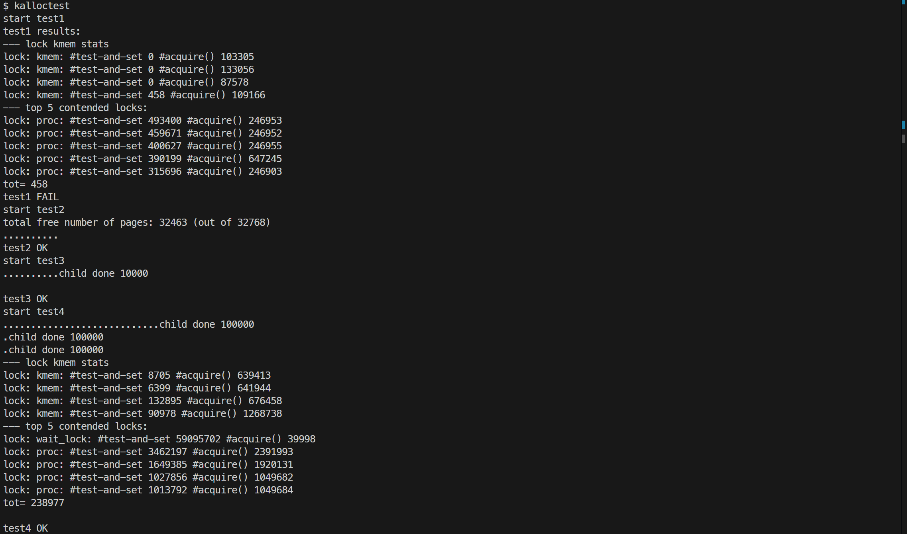
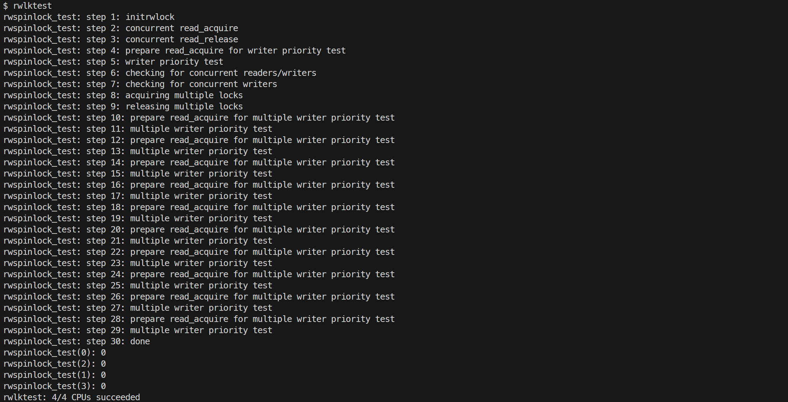
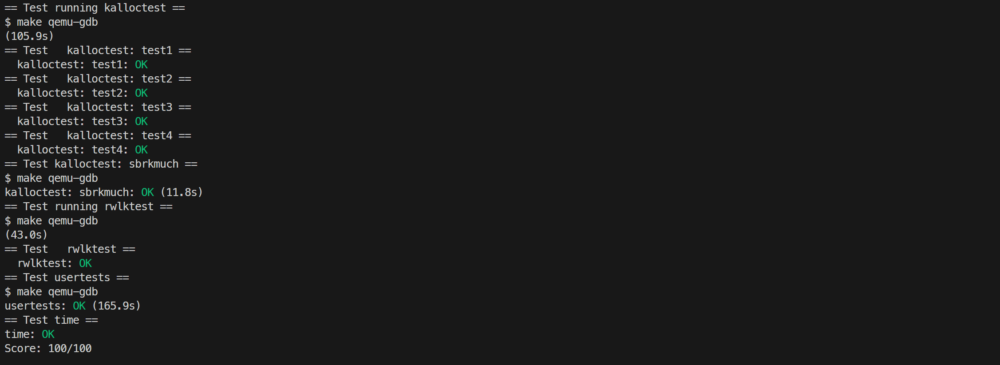

# 7. locks

## Memory allocator

### 要求

将 xv6 的物理内存分配器修改为每 CPU 一条空闲链表、每 CPU 一把锁，减少多核并发分配/释放内存时的锁争用。当某 CPU 的空闲链表为空时，允许从其他 CPU 的空闲链表"窃取"部分页面。

### 内容

xv6 原始实现中所有物理页共享同一条空闲链表，由 `kmem.lock` 一把锁保护，多核并发时竞争严重。将空闲链表、锁设置为每 CPU 一份，分配和释放只操作本 CPU 的链表，只有本 CPU 链表为空时才需要去其他 CPU 的链表偷页。

修改 `kernel/kalloc.c` 中的数据结构，将 `kmem` 改为数组，每 CPU 一个锁和一条空闲链表。

`kinit()` 为每个 CPU 的锁调用 `initlock()`，`freerange()` 通过 `kfree()` 把全部空闲内存挂入启动时执行 `kinit()` 的那个 CPU（即 CPU 0）的空闲链表，其余 CPU 初始为空，需要时再窃取。

```c
struct {
  struct spinlock lock;
  struct run *freelist;
} kmem[NCPU];

void kinit()
{
    for (int i = 0; i < NCPU; i++) {
        initlock(&kmem[i].lock, "kmem");
    }
    freerange(end, (void*)PHYSTOP);
}
```

`kfree()` 释放页面时，先用 `push_off()` 关闭中断，再调用 `cpuid()` 获取当前 CPU 编号，把页面挂到该 CPU 自己的空闲链表：

```c
void kfree(void* pa)
{
    struct run* r;

    if (((uint64)pa % PGSIZE) != 0 || (char*)pa < end || (uint64)pa >= PHYSTOP)
        panic("kfree");

    // Fill with junk to catch dangling refs.
    memset(pa, 1, PGSIZE);

    r = (struct run*)pa;

    push_off();
    int id = cpuid();

    acquire(&kmem[id].lock);
    r->next = kmem[id].freelist;
    kmem[id].freelist = r;
    release(&kmem[id].lock);

    pop_off();
}
```

`kalloc()` 优先从当前 CPU 的空闲链表取页；若为空，则按顺序轮询其他 CPU 的空闲链表，加锁后一次偷取最多 4 个页面，头页直接返回给调用者，其余页面挂入当前 CPU 的空闲链表，以减少后续再次触发偷取的频率：

```c
void* kalloc(void)
{
    struct run* r;

    push_off();
    int id = cpuid();

    acquire(&kmem[id].lock);
    r = kmem[id].freelist;
    if (r)
        kmem[id].freelist = r->next;
    release(&kmem[id].lock);

    if (!r) {
        for (int j = 0; j < NCPU; j++) {
            int i = (id + j) % NCPU;
            if (i == id) {
                continue;
            }
            if (!kmem[i].freelist) {
                continue;
            }
            acquire(&kmem[i].lock);
            if (kmem[i].freelist) {
                r = kmem[i].freelist;

                struct run* curr = r;
                int count = 1;
                while (curr->next && count < 4) {
                    curr = curr->next;
                    count++;
                }

                kmem[i].freelist = curr->next;
                curr->next = 0;
                release(&kmem[i].lock);
                if (r->next) {
                    acquire(&kmem[id].lock);
                    curr->next = kmem[id].freelist;
                    kmem[id].freelist = r->next;
                    release(&kmem[id].lock);
                }
                break;
            }
            release(&kmem[i].lock);
        }
    }

    pop_off();

    if (r)
        memset((char*)r, 5, PGSIZE); // fill with junk
    return (void*)r;
}
```

偷取时先对目标 CPU 的锁加锁，取出其链表头部（最多 4 页）并重新接好链表；之后若窃取的不止一页，再对当前 CPU 的锁加锁，把多余页面接入本 CPU 的空闲链表。

在 xv6 shell 中运行 `kalloctest`。



### 遇到的问题及心得

一开始实现偷页时，直接用循环变量作为 CPU 编号来查询其他 CPU 的空闲链表，即每次轮询都固定从 CPU 0 开始。结果所有 CPU 的窃取请求都集中到 CPU 0 等低编号 CPU 的锁上，这些锁被大量 `acquire()` 积压，仍造成了严重的锁竞争。后改为对当前 CPU 编号取模（`int i = (id + j) % NCPU;`），让每个 CPU 从自身编号开始向后轮询，不同 CPU 的窃取起点不同，避免了固定的锁热点。

## Read-write lock

### 要求

在 xv6 中实现读写自旋锁，允许多个读者同时持有锁，但写者独占且写者优先。

### 内容

实验在 `kernel/defs.h` 中已声明了读写锁 API（`initrwlock`、`read_acquire`、`read_release`、`write_acquire`、`write_release`），需要做的是在 `kernel/spinlock.h` 中定义 `struct rwspinlock`，并在 `kernel/spinlock.c` 中实现各函数。结构体内三个字段分别记录当前读者数、是否有写者持有、等待中的写者数，并有一把普通自旋锁保护 `reader_count` 与 `has_writer`，`waiting_writers` 不受保护，在修改时需保证使用原子操作。

```c
struct rwspinlock {
    struct spinlock lk;
    int reader_count;
    int has_writer;
    int waiting_writers;
};
```

`initrwlock()` 初始化内部变量。

```c
void initrwlock(struct rwspinlock* rwlk)
{
    initlock(&rwlk->lk, "rwlock");
    rwlk->reader_count = 0;
    rwlk->has_writer = 0;
    rwlk->waiting_writers = 0;
}
```

写者优先由 `waiting_writers` 计数器实现。写者获取锁时先原子地把它加一，声明有写者等待，再循环检查是否可以持有；读者获取锁前先检查该计数器，只要发现有待写写者就自旋等待，从而保证后来者不会再插队，写者不会被读者饿死。

```c
static void read_acquire_inner(struct rwspinlock* rwlk)
{
    while (1) {
        if (__atomic_load_n(&rwlk->waiting_writers, __ATOMIC_SEQ_CST) > 0) {
            continue;
        }

        acquire(&rwlk->lk);
        if (rwlk->has_writer == 0 && __atomic_load_n(&rwlk->waiting_writers, __ATOMIC_SEQ_CST) == 0) {
            rwlk->reader_count++;
            release(&rwlk->lk);
            break;
        }
        release(&rwlk->lk);
    }
}

static void write_acquire_inner(struct rwspinlock* rwlk)
{
    __atomic_fetch_add(&rwlk->waiting_writers, 1, __ATOMIC_SEQ_CST);

    while (1) {
        acquire(&rwlk->lk);
        if (rwlk->reader_count == 0 && rwlk->has_writer == 0) {
            __atomic_fetch_sub(&rwlk->waiting_writers, 1, __ATOMIC_SEQ_CST);
            rwlk->has_writer = 1;
            release(&rwlk->lk);
            break;
        }
        release(&rwlk->lk);
    }
}
```

读者在无锁状态下预检 `waiting_writers` 之后，到真正加锁之间可能已有写者声明等待，因此必须在持有内嵌锁时再次检查 `has_writer == 0 && waiting_writers == 0` 才能累加读者数，否则会出现读者插队到等待写者之前的情况。写者则必须等到 `reader_count == 0`（所有当前读者释放）且没有其他写者时才可进入。

释放操作同样以内嵌锁保护计数修改：读者把 `reader_count` 减一，写者清除 `has_writer`。

```c
static void read_release_inner(struct rwspinlock* rwlk)
{
    acquire(&rwlk->lk);
    rwlk->reader_count--;
    release(&rwlk->lk);
}

static void write_release_inner(struct rwspinlock* rwlk)
{
    acquire(&rwlk->lk);
    rwlk->has_writer = 0;
    release(&rwlk->lk);
}
```

对外接口 `read_acquire`/`write_acquire` 在调用内部函数前先 `push_off()` 关闭中断，`read_release`/`write_release` 在内部函数后 `pop_off()`。

在 xv6 shell 中运行 `rwlktest`。



### 遇到的问题及心得

一开始的实现是让内部自旋锁保护 `reader_count`、`has_writer`、`waiting_writers` 全部三个字段，但发现无法通过 `rwlktest`。原因是 xv6 的自旋锁是不公平的：等待中的写者并不比后续到达的读者更有机会获得锁，读者仍可能在写者之前插队，写者可能迟迟拿不到锁。后来修改为 `waiting_writers` 不由自旋锁保护，而是借助 GCC 的 `__atomic_*` 内建函数（如 `__atomic_fetch_add`、`__atomic_load_n`）保证其读写原子性，让写者在不争抢锁的情况下表示写意图。

## 评分


