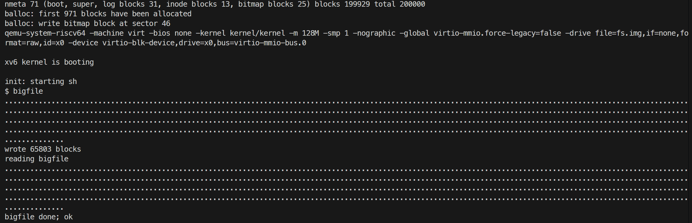
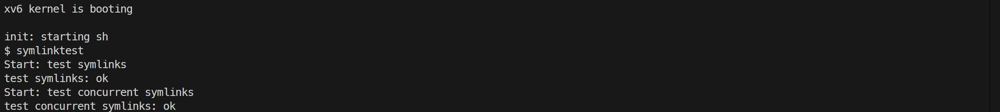

# 8. file system

## Large files

### 要求

将 xv6 的最大文件大小从 268 块提升到 65803 块。磁盘 inode 固定只有 13 个块号槽位，需要把直接块数从 12 减为 11，腾出第 13 个槽位存放二级间接块，使文件系统可寻址 `11 + 256 + 256×256 = 65803` 块。

### 内容

首先调整块号布局。在 `kernel/fs.h` 中，`NDIRECT` 由 12 改为 11，新增 `NININDIRECT`，修改 `MAXFILE`。

```c
#define NDIRECT 11
#define NINDIRECT (BSIZE / sizeof(uint))      // 256
#define NININDIRECT (NINDIRECT * NINDIRECT)   // 256 * 256
#define MAXFILE (NDIRECT + NINDIRECT + NININDIRECT)  // 65803
```

磁盘 inode 结构 `struct dinode` 的 `addrs[]` 由 `NDIRECT + 1`（13 项）相应地改为 `NDIRECT + 2`（仍为 13 项），使磁盘上 inode 的大小保持不变，前 11 项是直接块，第 12 项是一级间接块，第 13 项是新增的二级间接块。内存 inode 结构 `struct inode`（`kernel/file.h`）的 `addrs[]` 做同样修改。

在 `kernel/fs.c` 的 `bmap()`中，逻辑块号先与 `NDIRECT` 比较，命中则直接使用 `ip->addrs[bn]`；否则减去 `NDIRECT` 后与 `NINDIRECT` 比较，走一级间接块；再否则减去 `NINDIRECT`，进入二级间接块分支。此时 `bn / NINDIRECT` 是二级间接块中的索引（指向一个一级间接子块），`bn % NINDIRECT` 是该子块内的数据块索引：

```c
  bn -= NINDIRECT;

  if (bn < NININDIRECT) {
      if ((addr = ip->addrs[NDIRECT + 1]) == 0) {
          ip->addrs[NDIRECT + 1] = addr = balloc(ip->dev);
      }
      bp = bread(ip->dev, addr);
      a = (uint*)bp->data;

      uint idx1 = bn / NINDIRECT;
      uint idx2 = bn % NINDIRECT;
      uint sub_addr;
      if ((sub_addr = a[idx1]) == 0) {
          a[idx1] = sub_addr = balloc(ip->dev);
          log_write(bp);
      }
      brelse(bp);

      struct buf* sub_bp = bread(ip->dev, sub_addr);
      uint* sub_a = (uint*)sub_bp->data;
      if ((addr = sub_a[idx2]) == 0) {
          sub_a[idx2] = addr = balloc(ip->dev);
          log_write(sub_bp);
      }
      brelse(sub_bp);
      return addr;
  }

  panic("bmap: out of range");
```

二级间接块及其指向的一级间接子块都遵循"按需分配"原则，只有首次访问某个索引时才调用 `balloc()`，对块内地址数组的修改通过 `log_write()` 记入日志，每块由 `bread()` 读入的缓冲区在使用后都 `brelse()` 释放。

删除或截断文件时，`itrunc()` 在原有直接块、一级间接块释放逻辑之后追加二级间接块的释放，读入二级间接块，遍历其 256 项，对每个非空项读入对应的一级间接子块并释放其中的数据块，随后释放该子块本身，最后释放二级间接块并清零 `ip->addrs[NDIRECT + 1]`。

```c
  if (ip->addrs[NDIRECT + 1]) {
      bp = bread(ip->dev, ip->addrs[NDIRECT + 1]);
      a = (uint*)bp->data;
      for (i = 0; i < NINDIRECT; i++) {
          if (a[i]) {
              struct buf* sub_bp = bread(ip->dev, a[i]);
              uint* sub_a = (uint*)sub_bp->data;
              for (j = 0; j < NINDIRECT; j++) {
                  if (sub_a[j])
                      bfree(ip->dev, sub_a[j]);
              }
              brelse(sub_bp);
              bfree(ip->dev, a[i]);
          }
      }
      brelse(bp);
      bfree(ip->dev, ip->addrs[NDIRECT + 1]);
      ip->addrs[NDIRECT + 1] = 0;
  }
```

在 xv6 shell 中执行 `bigfile`。



### 遇到的问题及心得

本题未遇到问题。

## Symbolic links

### 要求

实现 `symlink(char *target, char *path)` 系统调用，在 `path` 处创建指向 `target` 的符号链接，`target` 不存在时创建也能成功，链接目标路径保存在链接 inode 的数据块中，成功返回 0、失败返回 -1。新增文件类型 `T_SYMLINK` 和打开标志 `O_NOFOLLOW`。修改 `open()`，默认递归跟随符号链接直到非链接文件，深度达到 10 视为循环并返回错误，带 `O_NOFOLLOW` 时直接打开链接本身。

### 内容

在 `Makefile` 的 `UPROGS` 中加入 `$U/_symlinktest`。

分配系统调用号并注册系统调用，`kernel/syscall.h` 中新增 `SYS_symlink`，`user/user.h` 与 `user/usys.pl` 分别加入声明和用户态入口，`kernel/syscall.c` 中声明 `sys_symlink()` 并加入 `syscalls` 数组。同时定义新的文件类型与打开标志，`O_NOFOLLOW` 取 `0x800`。

```c
// kernel/syscall.h
#define SYS_symlink 22

// kernel/stat.h
#define T_SYMLINK 4   // Symbolic link

// kernel/fcntl.h
#define O_NOFOLLOW 0x800

// user/user.h
int symlink(const char*, const char*);

// user/usys.pl
entry("symlink");
```

在 `kernel/sysfile.c` 中实现 `sys_symlink()`。用 `argstr()` 取回两个参数后，通过 `create(path, T_SYMLINK, 0, 0)` 创建类型为 `T_SYMLINK` 的新 inode，再用 `writei()` 把目标路径字符串整体写入该 inode 的数据块。由于目标路径是链接 inode 的内容，`target` 指向的文件此刻是否存在并不影响创建。

```c
uint64 sys_symlink(void)
{
    char target[MAXPATH], path[MAXPATH];
    struct inode* ip;
    if (argstr(0, target, MAXPATH) < 0 || argstr(1, path, MAXPATH) < 0) {
        return -1;
    }
    begin_op();
    ip = create(path, T_SYMLINK, 0, 0);
    if (ip == 0) {
        end_op();
        return -1;
    }
    if (writei(ip, 0, (uint64)target, 0, strlen(target)) != strlen(target)) {
        iunlockput(ip);
        end_op();
        return -1;
    }
    iunlockput(ip);
    end_op();
    return 0;
}
```

修改 `sys_open()` 以支持跟随链接。在 `namei()` 得到 inode 后，如果 `ip->type == T_SYMLINK` 且标志中未设置 `O_NOFOLLOW`，则进入循环，用 `readi()` 从链接 inode 读出目标路径，`iunlockput()` 释放链接 inode，再以 `namei()` 查找目标并加锁，目标不存在则 `open` 失败。循环深度达到 10 说明可能存在环，直接返回 -1。

```c
  if (ip->type == T_SYMLINK && !(omode & O_NOFOLLOW)) {
      int depth = 0;
      while (ip->type == T_SYMLINK) {
          if (depth >= 10) {
              iunlockput(ip);
              end_op();
              return -1;
          }
          depth++;
          char target[MAXPATH];
          int len = readi(ip, 0, (uint64)target, 0, sizeof(target) - 1);
          if (len < 0) {
              iunlockput(ip);
              end_op();
              return -1;
          }
          target[len] = '\0';
          iunlockput(ip);
          if ((ip = namei(target)) == 0) {
              end_op();
              return -1;
          }
          ilock(ip);
      }
  }
```

在 xv6 shell 中执行 `symlinktest`。



### 遇到的问题及心得

一开始对 inode 相关的操作函数以及 inode 锁的使用并不清楚，整理相关函数作用如下。

- `create(char *path, short type, short major, short minor)`
  解析 path 找到其父目录，调用 ialloc 在磁盘上分配一个新 inode（类型为 type），给新 inode 上锁，并将其文件名与 inode 编号记录写入父目录项，返回一个已经持有睡眠锁且引用计数 ref == 1 的 struct inode\* 指针。

- `namei(char *path)`
  路径解析，查找目标文件对应的内存 inode 缓存。将找到的 inode 引用计数加 1，但返回时未上锁。

- `readi(struct inode *ip, int user_dst, uint64 dst, uint off, uint n)`
  底层 inode 读取函数，从 ip 的第 off 个字节偏移量开始读取 n 字节数据到目标地址 dst。参数 user_dst=0 表示目标内存位于内核空间，user_dst=1 表示目标内存位于用户空间。调用者必须持有 ip 的睡眠锁。

- `ilock(struct inode *ip)`
  获取 inode 的锁，如果该 inode 尚未从磁盘读取到内存中，它还会负责调用底层驱动从磁盘把 inode 元数据读取出来。

- `iunlock(struct inode *ip)`
  释放 inode 的睡眠锁，但不减少引用计数。

- `iunlockput(struct inode *ip)`
  释放 ip 的睡眠锁，并将引用计数减 1。如果引用计数降为 0 且链接数为 0，则彻底回收该 inode 及其占用的磁盘数据块。

## 评分


