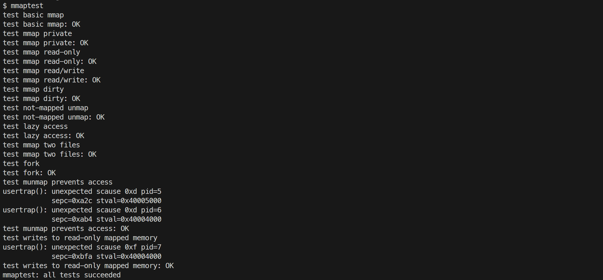
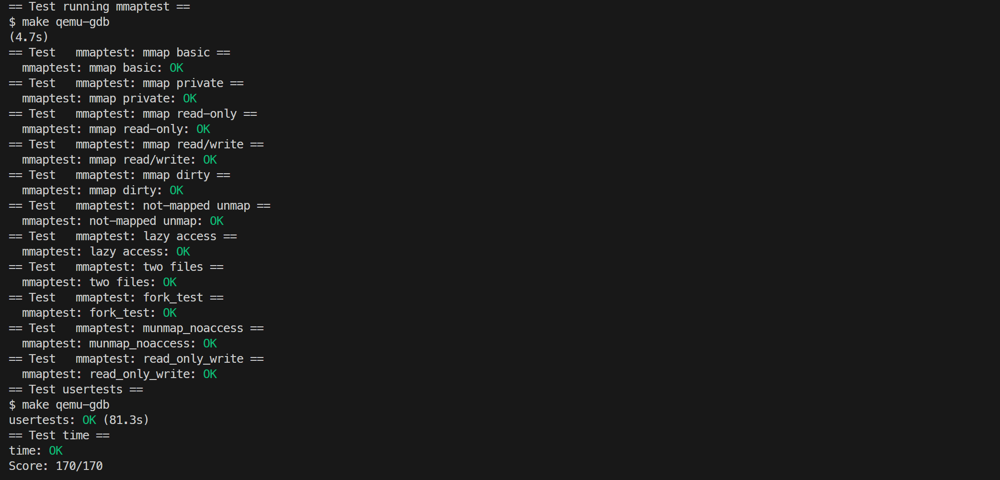

# 9. mmap

## mmap

### 要求

为 xv6 增加 `mmap` 与 `munmap` 两个系统调用，实现文件的内存映射。`mmap` 只需支持 `addr` 为 0（由内核选择映射地址）、`offset` 为 0、`prot` 为 PROT_READ/PROT_WRITE 或其组合、`flags` 为 MAP_SHARED（修改写回文件）或 MAP_PRIVATE（修改不写回）的情况。`mmap` 本身不分配物理内存也不读取文件，在访问映射区域发生缺页时，由 `usertrap` 中的缺页处理代码从文件读入。`munmap` 解除指定范围的映射，进程退出时对全部映射执行与 `munmap` 相同的处理。

### 内容

1. 在 `Makefile` 的 `UPROGS` 中加入 `$U/_mmaptest`，在 `user/user.h` 中声明两个系统调用，`user/usys.pl` 中注册对应入口，在 `kernel/syscall.h` 定义 `SYS_mmap 22`、`SYS_munmap 23`，并在 `kernel/syscall.c` 的系统调用表中注册 `sys_mmap`、`sys_munmap`。

2. 每个进程用一个固定大小的数组记录自己的虚拟内存区域 VMA。

```c
// kernel/proc.h
#define NVMA 16

struct vma {
    int used;       // 是否在使用
    uint64 addr;    // 映射的虚拟地址起始
    uint64 length;  // 映射长度
    int prot;       // PROT_READ, PROT_WRITE
    int flags;      // MAP_SHARED, MAP_PRIVATE
    struct file* f; // 对应的文件指针
    int offset;     // 文件偏移
};
```

`struct proc` 中增加 `struct vma vmas[NVMA];`。

3. `sys_mmap()` 依次取出六个参数并做基本检查：`PROT_WRITE` 与 `MAP_SHARED` 组合要求文件以可写方式打开，`PROT_READ` 要求文件可读，`length` 必须为正。然后寻找一个空闲 VMA，并从 `0x40000000` 开始为映射选择虚拟地址，若已有 VMA 则紧接其末尾继续分配。最后填写 VMA 字段，通过 `filedup()` 增加文件引用计数，保证映射建立后即使 `close(fd)` 文件结构也不会被释放。

```c
// kernel/sysfile.c
uint64 sys_mmap(void)
{
    uint64 addr;
    int length, prot, flags, fd, offset;
    struct file* f;
    struct proc* p = myproc();

    argaddr(0, &addr);
    argint(1, &length);
    argint(2, &prot);
    argint(3, &flags);
    argint(5, &offset);
    if (argfd(4, &fd, &f) < 0) {
        return -1;
    }
    if ((prot & PROT_WRITE) && (flags & MAP_SHARED) && !f->writable) {
        return -1;
    }
    if ((prot & PROT_READ) && !f->readable) {
        return -1;
    }
    if (length <= 0) {
        return -1;
    }

    struct vma* v = 0;
    for (int i = 0; i < NVMA; i++) {
        if (!p->vmas[i].used) {
            v = &p->vmas[i];
            break;
        }
    }
    if (!v) {
        return -1;
    }

    uint64 va = 0x40000000;
    for (int i = 0; i < NVMA; i++) {
        if (p->vmas[i].used) {
            if (p->vmas[i].addr + p->vmas[i].length > va) {
                va = PGROUNDUP(p->vmas[i].addr + p->vmas[i].length);
            }
        }
    }

    v->used = 1;
    v->addr = va;
    v->length = length;
    v->prot = prot;
    v->flags = flags;
    v->f = filedup(f);
    v->offset = offset;

    return va;
}
```

4. `usertrap()` 中拦截 RISC-V 的读缺页与写缺页时，调用 `mmap_fault()` 处理。先查找包含出错地址的 VMA，若地址不在任何 VMA 中，或发生写缺页但 VMA 没有写权限，返回失败，对应进程随后被 kill，否则分配一页物理内存并清零，计算该页在文件中的偏移，调用 `readi()` 从文件读入数据，最后按 VMA 的 `prot` 组装 PTE 权限并建立映射。

```c
// kernel/trap.c
int mmap_fault(struct proc* p, uint64 va, uint64 scause)
{
    struct vma* v = 0;

    for (int i = 0; i < NVMA; i++) {
        if (p->vmas[i].used && va >= p->vmas[i].addr && va < p->vmas[i].addr + p->vmas[i].length) {
            v = &p->vmas[i];
            break;
        }
    }
    if (v == 0 || (scause == 15 && !(v->prot & PROT_WRITE))) {
        return -1;
    }

    char* mem = kalloc();
    if (mem == 0) {
        return -1;
    }
    memset(mem, 0, PGSIZE);

    uint64 page_va = PGROUNDDOWN(va);
    uint64 offset = (page_va - v->addr) + v->offset;
    int read_len = PGSIZE;
    if (v->addr + v->length - page_va < PGSIZE) {
        read_len = v->addr + v->length - page_va;
    }

    ilock(v->f->ip);
    readi(v->f->ip, 0, (uint64)mem, offset, read_len);
    iunlock(v->f->ip);

    int pte_flags = PTE_U;
    if (v->prot & PROT_READ) {
        pte_flags |= PTE_R;
    }
    if (v->prot & PROT_WRITE) {
        pte_flags |= PTE_W;
    }
    if (v->prot & PROT_EXEC) {
        pte_flags |= PTE_X;
    }

    if (mappages(p->pagetable, page_va, PGSIZE, (uint64)mem, pte_flags) != 0) {
        kfree(mem);
        return -1;
    }

    return 0;
}
```

5. `sys_munmap()` 找到包含待解除地址的 VMA 后调用 `vma_unmap()` 辅助函数逐页处理。只对页表中已实际加载（PTE 有效）的页操作，若为 `MAP_SHARED`，先把页写回文件，`ilock` 后调用 `writei()` 把该页内容写到对应文件偏移，写回长度同时受 VMA 剩余长度和文件实际大小约束（`ip->size - offset`），避免把文件扩展到超出原有大小，若整页都在文件末尾之后则跳过写回。`writei` 一次最多写 `MAXOPBLOCKS` 允许的块数，必要时循环分块。用 `uvmunmap()` 解除该页映射并释放物理页。根据解除范围调整 VMA：整段解除时 `fileclose()` 并清空该 VMA；从开头解除时前进 `addr` 与 `offset`；从结尾解除时缩短 `length`。

```c
// kernel/sysfile.c
int vma_unmap(struct proc* p, struct vma* v, uint64 addr, uint64 length)
{
    for (uint64 curr = addr; curr < addr + length; curr += PGSIZE) {
        pte_t* pte = walk(p->pagetable, curr, 0);
        if (pte && (*pte & PTE_V)) {
            if (v->flags & MAP_SHARED) {
                uint64 offset = (curr - v->addr) + v->offset;
                int write_len = PGSIZE;
                if (v->addr + v->length - curr < PGSIZE) {
                    write_len = v->addr + v->length - curr;
                }

                begin_op();
                ilock(v->f->ip);
                if (offset >= v->f->ip->size) {
                    write_len = 0;
                }
                else if (offset + write_len > v->f->ip->size) {
                    write_len = v->f->ip->size - offset;
                }
                int max = ((MAXOPBLOCKS - 1 - 1 - 2) / 2) * BSIZE;
                int off = 0;
                while (off < write_len) {
                    int n1 = write_len - off;
                    if (n1 > max) {
                        n1 = max;
                    }
                    writei(v->f->ip, 1, curr + off, offset + off, n1);
                    off += n1;
                }
                iunlock(v->f->ip);
                end_op();
            }
            uvmunmap(p->pagetable, curr, 1, 1);
        }
    }

    if (addr == v->addr && length == v->length) {
        fileclose(v->f);
        v->f = 0;
        v->used = 0;
    }
    else if (addr == v->addr) {
        v->addr += length;
        v->offset += length;
        v->length -= length;
    }
    else if (addr + length == v->addr + v->length) {
        v->length -= length;
    }

    return 0;
}
```

6. `kfork()` 把父进程的 VMA 数组整体复制给子进程，并对每个 VMA 的文件调用 `filedup()` 增加引用，父进程已通过缺页加载过的映射页，为子进程单独分配新物理页并拷贝内容，未加载的页由子进程缺页时自行读入。

`kexit()` 在关闭文件之前遍历所有 VMA，对每个仍在使用的 VMA 调用 `vma_unmap()`，效果等同于进程退出前自动执行 `munmap`，保证 `MAP_SHARED` 的修改被写回文件。

```c
// kernel/proc.c kfork()
for (int i = 0; i < NVMA; i++) {
    if (p->vmas[i].used) {
        np->vmas[i] = p->vmas[i];
        filedup(p->vmas[i].f);

        for (uint64 va = p->vmas[i].addr; va < p->vmas[i].addr + p->vmas[i].length; va += PGSIZE) {
            pte_t* pte = walk(p->pagetable, va, 0);
            if (pte && (*pte & PTE_V)) {
                char* mem = kalloc();
                if (mem) {
                    memmove(mem, (char*)PTE2PA(*pte), PGSIZE);
                    int flags = PTE_FLAGS(*pte);
                    mappages(np->pagetable, va, PGSIZE, (uint64)mem, flags);
                }
            }
        }
    }
}

// kernel/proc.c kexit()
for (int i = 0; i < NVMA; i++) {
    if (p->vmas[i].used) {
        vma_unmap(p, &p->vmas[i], p->vmas[i].addr, p->vmas[i].length);
    }
}
```

7. 在 xv6 shell 中运行 `mmaptest`。



### 遇到的问题及心得

`mmaptest` 在 `test mmap dirty` 处失败，`mmaptest failure: dirty read #2, pid=3`。该测试先创建一个 1.5 页（6144 字节）的文件，把映射的前两页分别写成 `'B'` 和 `'C'` 后执行 `munmap(p, PGSIZE*2)`，随后重新打开文件，第一次 `read` 返回 4096 字节（第 0 页全为 `'B'`），第二次 `read` 期望只返回 2048 字节（PGSIZE/2）且内容为 `'C'`。也就是说写回后文件大小必须仍然是 6144 字节，即第 1 页只有前半段与文件内容重叠，后半段（超出原文件末尾的部分）不能写回。

最初 `vma_unmap` 中的写回长度只按 VMA 剩余长度截断，没有按文件大小截断，而 xv6 的 `writei()` 写到文件末尾之外时会把文件自动扩展，于是第 1 页整页 4096 字节都被写回，文件被撑到 8192 字节，第二次 `read` 返回了 4096 而不是期望的 2048，导致 `dirty read #2`。修复方式是在 `ilock` 之后读取 `ip->size`，把写回长度截断为 `ip->size - offset`。

## 评分


